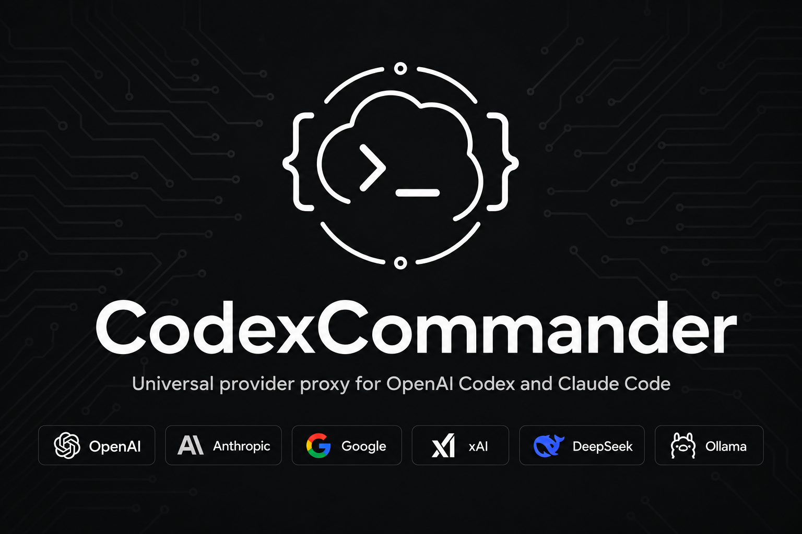
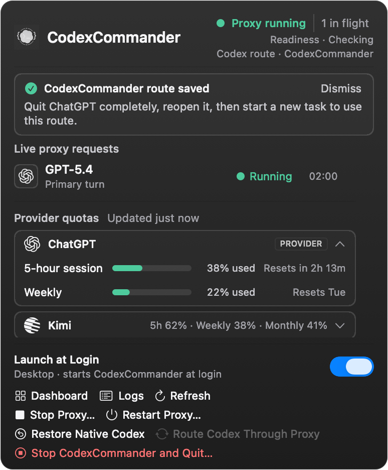

<h3 align="center">make codex open!</h3>
<p align="center"><b>Universal provider proxy for OpenAI Codex, Claude Code, Claude Desktop &amp; Grok Build</b><br>
Two commands, and every one of them runs any LLM you point it at.</p>

```bash
bun install
bun run build:gui
bun run src/cli/index.ts start
```

<p align="center">
  
</p>

<p align="center">
  <a href="README.md">English</a> · <a href="readme/README.ko.md">한국어</a> · <a href="readme/README.zh-CN.md">简体中文</a> · <a href="readme/README.ru.md">Русский</a> · <a href="readme/README.ja.md">日本語</a> · 📖 <a href="docs-site/src/content/docs/getting-started/installation.md"><b>Full documentation →</b></a>
</p>

<p align="center">
  <a href="https://github.com/pavelhov/CodexCommander/releases"><b>Download the current macOS preview (Intel + Apple silicon) →</b></a>
</p>

CodexCommander is a lightweight local proxy that translates Codex's Responses API into whatever your
provider speaks — streaming, tool calls, reasoning tokens, images, in both directions. Use Claude,
Gemini, Grok, GLM, DeepSeek, Kimi, Qwen, Ollama, or any other LLM with Codex, Claude Code, Claude
Desktop, and Grok Build. It can also manage a **ChatGPT account pool** for Codex auth: add accounts,
refresh their quotas in the dashboard, and let new sessions auto-route to the lowest-usage healthy
account while existing threads stay pinned to the account that started them.

## Quick start

### For humans

```bash
bun install
bun run build:gui
bun run src/cli/index.ts start   # or use `service` instead of `start`
```

The registry package is not currently published. These instructions run the checked-out source
with a locally installed [Bun](https://bun.sh). In this checkout, any documented `ccx <args>`
command can be run as `bun run src/cli/index.ts <args>`.

Open **http://localhost:10100** and configure everything in the web dashboard — add providers
(40+ built-ins, or any OpenAI-compatible endpoint), pick models, manage accounts. `ccx gui`
re-opens the dashboard at any time.
It can also manage a **ChatGPT account pool** for Codex auth. Add multiple ChatGPT / Codex accounts,
refresh their 5h / weekly / 30d quota in the dashboard. Under quota routing, new sessions can use
the lowest-usage healthy account; round-robin and fill-first use their own policies. Existing Codex
threads normally retain affinity to the account that started them, so long SSH, tmux, or
mobile-connected sessions do not jump accounts mid-conversation — but quota re-evaluation, failover,
account exclusion, affinity expiry, or 401/403 and 429 recovery can rebind them. Give the accounts a
selection order when one of them — usually your Codex Desktop login — should only be reached for
once the others are drained.

### macOS menu bar companion

The native companion shows live agent activity and provider quota windows, then opens the existing
dashboard for OAuth, API keys, account management, and logs. It is a UI layer over the running
proxy: it does not use Keychain, create a second provider-login system, or store provider credentials
in the app.

**[Download the current CodexCommander preview for macOS](https://github.com/pavelhov/CodexCommander/releases)**
(Intel + Apple silicon). On the release page, download the universal `.zip` and its matching
`.sha256` checksum file.

This preview requires macOS 13 or later. It is ad-hoc signed and not notarized yet:

1. Download and unzip it, then move `CodexCommander.app` to **Applications**.
2. Control-click the app and choose **Open**.
3. If macOS still blocks it, open **System Settings → Privacy & Security** and choose **Open
   Anyway**. Do not disable Gatekeeper. See [Apple's instructions](https://support.apple.com/guide/mac-help/open-a-mac-app-from-an-unknown-developer-mh40616/mac).

On a fresh Mac, a direct app launch creates CodexCommander's secret-free ChatGPT passthrough default
automatically. If Codex has not created `~/.codex/config.toml` yet, the proxy and dashboard still start
while Codex remains native; open Codex once, then choose **Route Codex Through Proxy** from the menu.
The app never creates Codex configuration automatically. Existing valid, invalid, unreadable, or
unsafe CodexCommander configuration is preserved and is never overwritten; repair an invalid or
inaccessible configuration before trying again. Providers, API keys, and OAuth accounts are not copied
from another Mac. Public distribution uses the universal release archive above, not the thin
development `.app` produced by a source checkout.

Applications and `~/Applications` support **Launch at Login**. A copy launched from Desktop or
Downloads is allowed to run for the current session, but the app shows neutral guidance to move it to
Applications for login startup. Quit CodexCommander before moving a running app, then reopen it from
its new location; the app never moves itself. If macOS launches the app through App Translocation,
**Start** is blocked before the proxy launches: move the app and reopen it. These location rules do not
change the ad-hoc Gatekeeper steps above.

<p align="center">
  
</p>

| Action | What it does |
|---|---|
| **Start Proxy** | Starts or attaches to the proxy, then routes Codex through it. |
| **Restore Native Codex** | Switches only Codex back to OpenAI; the proxy keeps running. |
| **Route Codex Through Proxy** | Switches only the Codex route to the already-running proxy. |
| **Stop Proxy… / Restart Proxy…** | Restores native routing before stopping; Restart then starts and routes back. |
| **Quit Menu Bar** | Closes only the menu app; the proxy and current route keep running. |
| **Stop CodexCommander and Quit…** | Restores native Codex, stops the proxy and service, then quits the menu app. |

Here, **Restore Native** means removing CodexCommander-owned routing. A user-managed external Codex
provider is left unchanged.

Route changes show a spinner, elapsed time, and the real **Changing route → Confirming route**
phases. After a confirmed route change, quit ChatGPT completely, reopen it, and start a new task.

#### Build or package it yourself

The development build stays at `dist/macos/CodexCommander.app`:

```bash
bun install
bun run test:macos
bun run build:macos
open dist/macos/CodexCommander.app
```

To create an Intel + Apple silicon release ZIP and SHA-256 file in `dist/release` (full Xcode
required):

```bash
UNIVERSAL=1 bun run package:macos
```

Every built app launches only the Bun runtime and server resources embedded in its own
`Contents/Resources/runtime`; it never executes checkout `src/` or an ambient `ccx`. Rebuild the app
to pick up source changes. If startup fails, the menu app stays open so its diagnostics and **Start**
control remain available.

The native escape itself removes only CodexCommander's marker-owned routing and owned catalog pointer
from `$CODEX_HOME/config.toml`; after proving that exact route, it also clears the proxy-only root
`provider/model` selector. Every unrelated setting remains byte-for-byte unchanged. It does not touch
Codex tasks, history, or authentication, and it does not require a repair command or coordinator
database. Generated catalogs and caches may remain on disk, but native Codex no longer references
them.

On its first launch, the app enables **Launch at Login** so the menu icon returns after sign-in.
On every new manual or Login Item launch, the app performs an explicit **Start**: it starts or
attaches to the proxy, then routes managed Codex through it. An external user-managed Codex provider
is preserved. The startup row exposes the actual mode: **Desktop**
performs this app-managed start, **Headless** leaves only an installed background service at login,
and **Off** starts neither automatically. Rebuilt source apps refresh their login registration in
place; they are never copied into Application Support. Full
setup, Gatekeeper, release packaging, and troubleshooting details are in the
[macOS menu bar guide](docs-site/src/content/docs/guides/macos-menu-bar.md).

### OpenCode client

`ccx opencode` starts OpenCode with a transient, in-memory `provider.codexcommander` block and never
rewrites OpenCode config files. For plain OpenCode or the Desktop app, use the dashboard's
**Integrations** page to apply the opt-in, reversible connection that owns only
`provider.codexcommander`; see the [OpenCode guide](docs-site/src/content/docs/guides/opencode.md).

### For agents

```bash
bun run src/cli/index.ts start     # or use `service`
bun run src/cli/index.ts init      # interactive setup: writes config; can route through a proven live proxy
```

`ccx init` never starts the proxy. If a current-home proxy is already running and its protected
runtime identity is proven, the wizard can route Codex through it; otherwise Codex stays native
until an explicit `ccx start`. Headless commands like `ccx provider add` and `ccx combo set` talk to
the **live** proxy and exit nonzero when it is unreachable. `ccx status` / `ccx doctor` / `ccx
health` report the running state.

The source/headless path requires `ccx init` (or the equivalent `bun run src/cli/index.ts init`) to
create CodexCommander's configuration before ordinary CLI starts. Ordinary CLI startup does not own
the macOS app's automatic bootstrap and refuses a missing configuration; it never creates a Codex
config or a hand-written JSON substitute. Existing Codex configuration, including an external provider,
is left untouched unless you explicitly choose a CodexCommander route.

## Supported platforms

| OS | Status | Service manager |
|---|---|---|
| macOS (arm64 / x64) | Fully supported | launchd |
| Linux (x64 / arm64) | Fully supported | systemd (user unit) |
| Windows (x64) | Fully supported | Task Scheduler (hidden) / opt-in native service (`--native`, WinSW) |

Running from source requires [Bun](https://bun.sh). Windows runs natively without WSL. See the
[installation docs](docs-site/src/content/docs/getting-started/installation.md).

## Highlights

- **Use any LLM with Codex, Claude Code, Claude Desktop, and Grok Build** — 40+ providers out of
  the box, each keeping its own native UI.
- **Pool ChatGPT accounts safely** — thread affinity, quota-aware auto-switching, cooldown and
  fail-closed auth handling.
- **Combos** — one virtual model id with failover or weighted round-robin across providers. See
  the [combo guide](docs-site/src/content/docs/guides/combos.md).
- **Sub-agents on any model** — feature routed models in Codex's sub-agent picker, with v1/v2
  surface control and fallback chains. See the
  [sub-agent guide](docs-site/src/content/docs/guides/sub-agent-surface.md).
- **Log in once, skip the API key** — OAuth for xAI, Anthropic, and Kimi; or forward
  `codex login`, paste a key, or use `${ENV_VAR}` references.
- **Web search & vision sidecars** — non-OpenAI models get real web search and image understanding
  through a sidecar over your ChatGPT login.
- **See what's happening** — the dashboard shows providers, OAuth status, model selection, and a
  live request log with cache token counts.
- **Native macOS glance view** — see active parent/subagent rows and every available session,
  weekly, monthly, or credit quota window without duplicating provider setup outside the dashboard.
- **Safe native escape** — `ccx stop` saves the integration as OFF, proves native Codex routing, and
  only then stops the service and proxy. It never rewrites tasks, history, or authentication.

## Model routing

Target any configured provider and model with the `provider/model` syntax:

```bash
codex -m "anthropic/claude-opus-5" "Explain this stack trace"
codex -m "google/gemini-3-pro" "Write unit tests for auth.ts"
codex -m "ollama/llama3" "Refactor this function"
```

Omit the `provider/` prefix to use the default provider or auto-match by model name pattern.
Provider model ids containing `/` are exposed with inner slashes aliased to `-`; the raw
full-slash form keeps working too. Details: [model routing docs](docs-site/src/content/docs/guides/model-routing.md).

## Providers & adapters

OpenAI (ChatGPT login or API key), Anthropic, Google Gemini, xAI, Kimi, Azure OpenAI, Ollama
(local + Cloud), Cursor (experimental), and every OpenAI-compatible endpoint — plus DeepSeek,
Groq, OpenRouter, Together, Fireworks, Cerebras, Mistral, Hugging Face, NVIDIA NIM, MiniMax,
Qwen Cloud, SiliconFlow, and more. Full list: `ccx init` or the
[provider docs](docs-site/src/content/docs/guides/providers.md).

## CLI

```bash
ccx init                       # interactive setup (writes config, wires Codex, offers the shim)
ccx start [--port 10100]       # start the proxy and route Codex through it
ccx stop                       # restore native Codex, then stop the proxy
ccx restart                    # CLI stop + start cycle
ccx restore                    # restore native Codex; leave the proxy unchanged
ccx restore back               # route Codex through an already-running proxy
ccx service [install|start|stop|status|uninstall|remove]  # background service
ccx codex-shim install         # start the proxy on demand whenever `codex` launches
ccx health [--json]            # check immediate proxy liveness
ccx ready [--json] [--wait [--timeout <seconds>]]  # check post-sync readiness
ccx status                     # is the proxy running?
ccx gui                        # open the web dashboard
ccx provider <...>             # manage providers (list/add/edit/test/remove)
ccx account <...>              # manage ChatGPT accounts & API-key pools
ccx combo <...>                # manage failover / round-robin combos
ccx v2 <...>                   # multi-agent v1/v2 surface controls
```

Unpinned starts may pick another free port if the preferred one is busy; an explicit `--port`
never hops. Full reference: [CLI docs](docs-site/src/content/docs/reference/cli/lifecycle.md).

### Health and readiness

`GET /healthz` reports immediate proxy liveness. The unauthenticated `GET /readyz` endpoint reports
post-sync readiness with the sanitized JSON identity `{service, version, uptime, pid, port, status}`.
It returns `200` when `status` is `ready`; `pending` and terminal `failed` return `503` with
`Retry-After: 1`.

`ccx ready [--json] [--wait [--timeout <seconds>]]` performs one probe by default. `--wait` polls
for up to 45 seconds by default, but exits immediately when it observes terminal `failed`;
`--timeout <seconds>` sets a 1–300 second limit, requires `--wait`, and accepts only positive integers. CLI `--json` output is
`{ready, status, pid, port}`, where `status` is `ready`, `pending`, `failed`, or `unreachable`.

| Exit | Result |
| --- | --- |
| `0` | Ready |
| `1` | Not ready: pending, failed, timeout, or unreachable |
| `64` | Invalid arguments |

### Autostart: service vs shim

Use the **service** (`ccx service`) for an always-on proxy that restarts on crash. Use the
**shim** (`ccx codex-shim install`) for lightweight, on-demand startup without a background
daemon. Remove them with `ccx service uninstall` / `ccx codex-shim uninstall`.

### Uninstall

```bash
ccx uninstall                  # stop, remove service/shim, restore native Codex, clean local artifacts
```

## Remote access

By default CodexCommander binds to `127.0.0.1` and needs no extra authentication. Binding beyond
loopback (`"hostname": "0.0.0.0"`) **requires** a bearer token — the proxy refuses to start
without `CODEXCOMMANDER_API_AUTH_TOKEN`, and every client request must carry it as
`x-codexcommander-api-key`. Details: [configuration reference](docs-site/src/content/docs/reference/configuration/server.md).

## Documentation

The docs — install, providers, routing, combos, sub-agents, sidecars, integrations, and the
CLI/config/management-API references — live in [`docs-site/`](./docs-site). They build locally;
publishing automation is not included in this repository.

Maintainer source-of-truth notes live under [`structure/`](./structure), contributor setup in
[`CONTRIBUTING.md`](./CONTRIBUTING.md), and security reporting in [`SECURITY.md`](./SECURITY.md).
Report undisclosed vulnerabilities privately through
[GitHub private vulnerability reporting](https://github.com/pavelhov/CodexCommander/security/advisories/new),
not a public issue.

## Development

Source development requires the `bun` CLI on your `PATH`.

```bash
cd /path/to/CodexCommander
bun install
bun run typecheck
bun run test:parallel   # preferred — much faster (parallel runner)
bun run test            # serial fallback
```

See **[Contributing](./CONTRIBUTING.md)**.

## Disclaimer

CodexCommander is an independent, community-maintained project and is **not affiliated with or endorsed by OpenAI, Anthropic, or any other provider**.

Some providers — notably Anthropic (Claude) — may suspend or restrict accounts that route API traffic through third-party proxies. **Use at your own risk (UAYOR).** Before connecting a provider, review its Terms of Service to confirm that proxy-based access is permitted. The CodexCommander maintainers are not responsible for any account actions taken by upstream providers.

## License

MIT

The MIT license permits forks, modification, distribution, and sale subject to its notice condition.
It does not grant third-party product names, logos, or trademark rights. A rebrander or commercial
redistributor must audit names, logos, and trademarks; preserve the MIT and applicable third-party
notices; avoid claims that it pools or resells third-party credentials or subscriptions; and use its
own bundle identifier, signing and notarization, distribution metadata, and package metadata. This is a
release-operational checklist, not legal advice.
