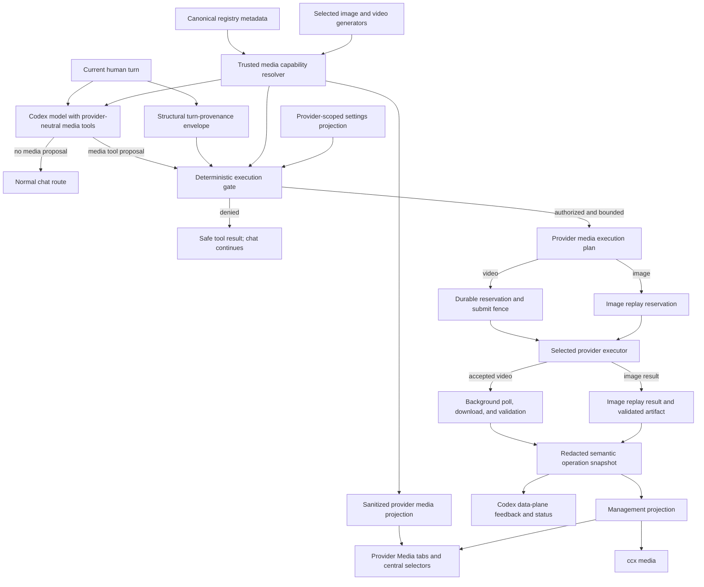
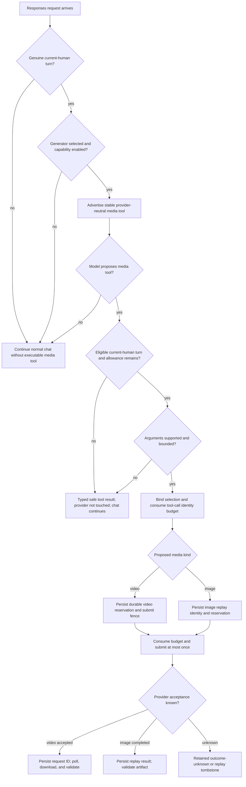
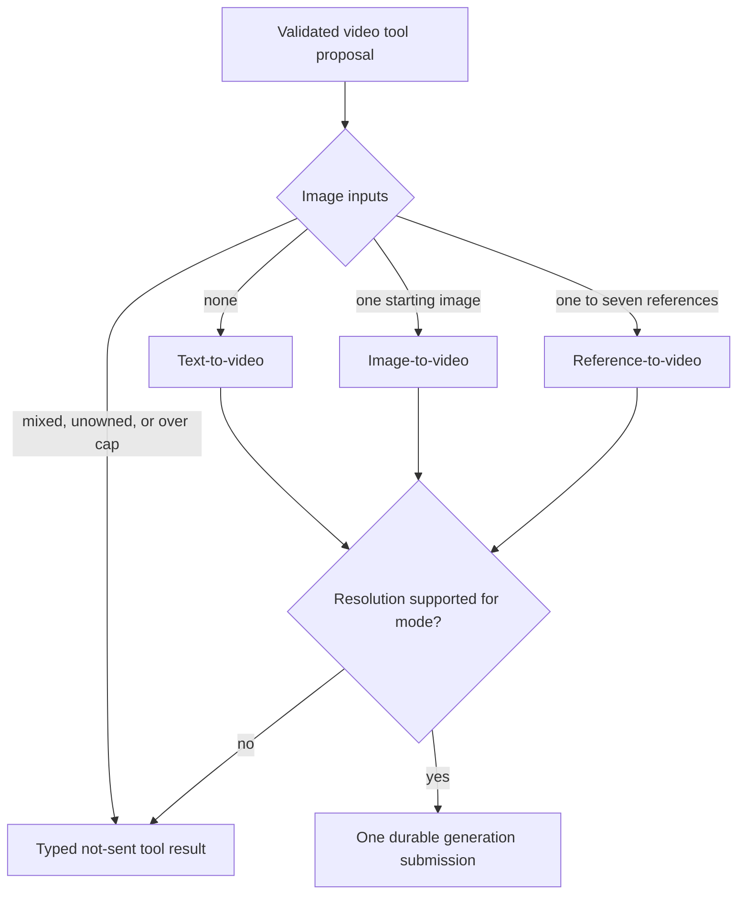

# Provider Media Reliability - Plan

## Goal Capsule

- **Objective:** Users can discuss media normally and ask Codex to generate images or videos through their selected provider with truthful readiness, progress, limit, recovery, and artifact feedback. No media setting may break ordinary chat, create an unbounded paid submission, or silently change providers.
- **Means:** Expose stable provider-neutral media tools from trusted capability metadata, let Codex select them semantically, and enforce provider selection, current-turn content-egress authority, bounds, input-mode constraints, direct executor binding, and replay safety at execution (KTD1-KTD11).
- **Authority hierarchy:** The operator's selected generator governs routing. The current human turn plus the model's media tool proposal governs whether execution is attempted. Deterministic execution policy governs spend bounds. Durable job state governs recovery.
- **Execution profile:** Start with characterization and regression coverage at the request-admission boundary. Land provider metadata and safe contracts before relocating the UI.
- **Stop conditions:** Stop if the work requires automatic replay of an uncertain paid POST, free-form provider-message parsing, weaker management authorization, credential or provider fallback, or disclosure of prompts, credentials, provider request IDs, signed URLs, or local paths.
- **Tail ownership:** The implementation owner carries API, GUI, CLI, documentation, security review, privacy validation, and cross-platform regression coverage through completion.

---

## Product Contract

### Summary

Media generation becomes a provider-owned capability with central image/video generator selection in the Providers workspace and an extension contract that future providers can implement.
Codex receives stable provider-neutral media tools and decides semantically when to propose them, while CodexCommander enforces current-turn provenance, selected-provider binding, bounded execution, and truthful lifecycle feedback.

### Problem Frame

Enabling Grok video currently changes the admission path for every Responses request.
Conversational wording that mentions video can become `confirmation_required`, which the server converts into a request-wide 409 before normal model routing.
The result is a system error in Codex even though no provider submission was attempted.

The management UI compounds the problem.
It presents Grok media as a global dashboard feature, exposes a production probe that is intentionally preflight-blocked, calls a locally bindable credential "ready," and collapses distinct failures into a stale/refused banner.
Provider usage exhaustion, rate limiting, authentication, policy rejection, transport uncertainty, and artifact failure therefore do not reach users with enough truth to recover safely.

The existing paid-video runtime already protects the hardest boundaries: stable credential binding, a durable pre-submit fence, no automatic replay after an ambiguous submission, restart-safe polling, private artifact download, validation, and human-only recovery actions.
This plan preserves those invariants and fixes the admission, provider abstraction, readiness, error, lifecycle, and UX contracts around them.

### Actors

- A1. **Codex user:** discusses media, makes an explicit generation request, and consumes feedback or an artifact.
- A2. **Operator:** configures provider-owned media settings, selects the default image/video generators, and performs human-only recovery actions.
- A3. **Codex agent:** selects provider-neutral media tools from the user's meaning, reports redacted job state, and consumes authenticated artifact references.
- A4. **Media provider:** authenticates the bound source, accepts or rejects generation, exposes asynchronous job state, and returns temporary output references.

### Key Decisions

- **Provider-owned setup with central generator selection.** Each provider owns its Media settings, while the Providers workspace selects the default image and video generators independently. Governs R5-R7, R15-R17, R20. (session-settled: user-approved — chosen over a global Grok-only card or provider-specific tool names: provider ownership plus one routing selector supports Grok, Seedance, Runway, and future adapters.)
- **Model-mediated media selection with deterministic execution policy.** Codex decides semantically whether to propose a provider-neutral media tool; tool availability and media words never dispatch generation. CodexCommander enforces current-human-turn provenance, one bounded operation, selected-provider binding, and at-most-once execution without a second confirmation. Governs R1-R4, R7, R8. (session-settled: user-approved — chosen over keyword-gated tool exposure or model-only unbounded execution: the requested experience matches native image generation while keeping deterministic spend controls.)
- **No silent fallback.** A selected media provider and credential source remain fixed for the operation. Governs R7, R8. (session-settled: user-approved — chosen over automatic fallback: fallback could change billing, privacy, output behavior, or provider attribution.)
- **Readiness is factual, not predictive.** The product reports credential, model-access, billing-knowledge, and runtime facts separately and never uses paid generation as an ordinary readiness probe. Governs R9, R10. (session-settled: user-approved — chosen over the blocked paid capability probe: xAI exposes no reliable per-request quota or readiness contract.)
- **Grok video accepts text, a starting image, or reference images.** The generic video capability supports text-to-video, one-source image-to-video, and provider-bounded reference-to-video as mutually exclusive modes. Resolution is selected for the generation request and is never an automatic post-generation upscale. Governs R3, R4, R7, R8, R21, R22. (session-settled: user-approved — chosen over text-only video or implicit image/upscale preprocessing: the user approved native Grok image inputs while keeping provider limits and cost visible.)
- **Direct REST execution, not Grok CLI orchestration.** Grok media uses CodexCommander's existing fixed-origin xAI transport and durable journal. The official Grok Build implementation is compatibility evidence only; CodexCommander does not launch a second Grok agent for paid media execution. Governs R7, R8, R13-R18, R23. (session-settled: user-approved — chosen over invoking `/imagine-video` through a Grok CLI subprocess: direct REST preserves deterministic typed inputs, structured failures, native text-to-video, 1080p generation, and restart-safe request-ID recovery.)
- **Bounded inline image transport.** Authorized starting and reference images are materialized as metadata-minimized validated snapshots and sent as base64 data URIs in the one generation POST. Governs R2-R4, R21, R23, R24. (session-settled: user-approved — chosen over public or signed URLs and provider Files uploads: request-local base64 avoids a second retention surface and does not disclose local paths.)

### Requirements

**Chat and authorization**

- R1. Media words, tool availability, and provider capability never dispatch generation; a turn without a model media-tool proposal continues through normal chat.
- R2. Only a genuine current-human turn may carry media execution authority. Historical, assistant-authored, tool-authored, delegated, replayed, and compaction content cannot mint or replenish it.
- R3. A model media-tool proposal on an eligible current-human turn may execute one bounded operation for the proposed kind, count, and provider-supported settings.
- R4. Missing authority, unsupported arguments, unavailable credentials, and local allowance failures return a typed safe tool result inside the turn without a request-wide media error or provider request.

**Provider routing and configuration**

- R5. Media capabilities are declared by provider-owned metadata and rendered only for providers that expose the relevant descriptor.
- R6. Each capable provider owns a Media area for its credentials, models, readiness, settings, jobs, and recovery.
- R7. Runtime dispatch resolves the independently selected image or video generator, executor, credential source, model, and capability before any provider request.
- R8. Absence, authentication failure, permission failure, usage exhaustion, rate limiting, outage, or validation failure never triggers another provider, credential source, or native media route.

**Readiness and probe behavior**

- R9. Readiness separates local configuration, credential availability, verified model access, billing knowledge, quota knowledge, provider observation freshness, and recovery admission.
- R10. Ordinary readiness performs no media generation and never claims that quota, billing, or the next request is guaranteed when the provider cannot prove it.

**Failure truth and lifecycle**

- R11. Every safe media failure carries an origin, lifecycle stage, user-facing category, retry posture, recovery action, and paid-submission certainty without exposing provider secrets or free-form response bodies.
- R12. Usage exhaustion remains distinct from rate limiting and permission denial when positive structured evidence exists; ambiguous upstream signals remain explicitly unknown rather than guessed.
- R13. Long-running video work exposes truthful semantic states from durable admission through validated artifact readiness, continues safely after client detachment, and never invents an ETA, cancellation, or percentage that cannot survive restart.
- R14. An uncertain paid submission remains fenced as outcome unknown and cannot be automatically resubmitted; polling, download, and validation may retry only within the existing accepted operation.

**Compatibility and safety**

- R15. Existing `images.*` configuration, `/api/media`, `ccx media`, independent image/video toggles, and accepted-job recovery remain compatible while the new provider-owned projection is introduced.
- R16. Source or model changes apply only to new work; accepted jobs retain their persisted credential binding, model, deadline, revision, and artifact/recovery semantics.
- R17. Default-generator selection, media-setting changes, billing-source changes, outcome-unknown acknowledgement, recovery quarantine/reset, and OS open/reveal actions remain human-only and revision-bound.
- R18. API-key media is identified as the documented xAI inference route; subscription OAuth remains experimental and must not claim official xAI API, billing, quota, or entitlement guarantees.
- R19. All new GUI behavior is accessible, localized in every supported locale, and aligned with the CLI and agent-facing redacted resource.
- R20. The Providers workspace exposes independent default image-generator and video-generator selectors; changing either selection affects new operations only.
- R21. The provider-neutral video tool supports text-to-video, exactly one starting-image reference, or a provider-bounded list of reference images; starting-image and reference-image inputs are mutually exclusive and invalid combinations fail before provider dispatch. The selected descriptor also owns per-mode duration bounds and defaults.
- R22. Video resolution is an explicit generation-time setting validated against the selected provider, model, and input mode. Grok preserves the existing 720p compatibility default when the user does not request quality; CodexCommander never adds an automatic post-generation upscale, silently raises resolution, or silently downgrades an unsupported request.
- R23. Grok media execution uses the direct fixed-origin xAI REST executor for both API-key and experimental subscription-OAuth sources. It never launches Grok Build as a media subprocess or delegates a paid media request to a second agent.
- R24. Before image bytes leave the process, CodexCommander binds the exact current-turn prompt and selected attachment or artifact handles into an immutable media-egress envelope, resolves them to validated metadata-minimized snapshots, and sends only bounded base64 data URIs. Raw HTTP(S), file, blob, caller-supplied data URIs, provider Files uploads, and unrelated attachments are rejected before provider dispatch.

### Key Flows

- F1. **Configure and select media providers**
  - **Trigger:** A2 opens a capable provider's Media area or the Providers workspace generator selectors.
  - **Steps:** The provider area loads provider-owned settings and readiness. The central selectors list capable providers and apply revision-bound image/video routing changes independently.
  - **Outcome:** New work uses the selected provider and source. Existing work retains its original binding.
  - **Covered by:** R5-R10, R15-R20.
- F2. **Continue ordinary chat**
  - **Trigger:** A1 discusses video or images without asking Codex to generate media.
  - **Steps:** The provider-neutral tool may be available, but the model does not propose it. The normal provider route executes without a media-specific HTTP error or provider submission.
  - **Outcome:** Codex answers the conversation normally and no media provider is contacted.
  - **Covered by:** R1, R2, R4.
- F3. **Start an explicit media operation**
  - **Trigger:** A1 explicitly requests supported image or video generation.
  - **Steps:** Codex proposes the provider-neutral media tool with text-only, starting-image, or reference-image intent. CodexCommander resolves only current-turn attachments or explicitly referenced authenticated artifacts, validates the mutually exclusive input mode and generation-time resolution, binds the selected provider, source, model, settings, and tool-call identity, consumes the bounded allowance, and establishes the paid-submission fence before dispatch.
  - **Outcome:** A synchronous image returns a validated artifact, or a video returns durable acceptance and lifecycle feedback.
  - **Covered by:** R3, R4, R7, R8, R11-R16, R21, R22.
- F4. **Observe long-running video work**
  - **Trigger:** A4 accepts a video job.
  - **Steps:** The agent and management surfaces observe the same redacted job revision and semantic state. Safe poll/download work continues after disconnect or restart.
  - **Outcome:** The job reaches a validated authenticated artifact, an actionable terminal failure, needs-auth, expiry, or outcome-unknown hold without a duplicate POST.
  - **Covered by:** R11-R17, R19.
- F5. **Recover from a failure**
  - **Trigger:** A job needs credentials, reaches an uncertain submission outcome, or encounters journal recovery state.
  - **Steps:** A3 reports the safe reason and required human action. A2 performs only the allowed revision-bound recovery action.
  - **Outcome:** Recovery resumes the same accepted operation or releases its fence without claiming cancellation, refund, or provider failure.
  - **Covered by:** R11-R17.

### Acceptance Examples

- AE1. Covers R1, R2. Given a video generator is selected and its generic tool is available, when the user asks whether a social strategy can include stories and videos, then Codex returns a normal chat answer and the media provider receives no request.
- AE2. Covers R2. Given a previous turn, quotation, assistant message, tool result, or delegated task contains "make a video," when the current user asks a non-media question, then that content cannot authorize or replenish a media operation.
- AE3. Covers R3, R7, R13. Given Grok is the selected video generator and the source is usable, when the user says "make me one eight-second video of a fox in snow" and Codex proposes the generic video tool, then exactly one bounded operation is admitted, the user sees durable acceptance and semantic progress, and completion returns the validated local artifact.
- AE4. Covers R3, R8. Given the user asks for three images and the descriptor cap permits three, when the operation runs, then exactly three outputs are authorized against the selected provider and no other media provider or credential source is contacted.
- AE5. Covers R4, R11. Given Codex proposes an unsupported edit or count, when local validation fails, then the model receives an actionable safe tool result with `submission certainty = not sent`, the turn continues, and no provider request occurs.
- AE6. Covers R9, R10, R18. Given subscription OAuth is selected and locally available, when the Media area loads, then it reports the credential fact and unknown official quota/model guarantees without offering a paid readiness probe.
- AE7. Covers R11, R12. Given positive structured provider evidence shows an exhausted usage allowance, when submission is rejected, then the user sees usage exhausted rather than rate limited, stale, or generic upstream failure.
- AE8. Covers R11, R12. Given a 429 without positive quota evidence, when submission is rejected, then the user sees rate limited and any safe retry guidance; the UI does not claim the account balance is exhausted.
- AE9. Covers R14, R17. Given a paid POST may have reached the provider but no request ID is known, when the transport fails, then the job becomes outcome unknown, no automatic resubmission occurs, and the human warning explains that acknowledgement does not cancel or refund remote work.
- AE10. Covers R13-R16, R19. Given an accepted video outlives the Codex turn or process, when the user returns, then Codex, CLI, and Providers > Grok show the same safe state and revision until a validated artifact or terminal recovery state exists.
- AE11. Covers R7, R8, R16, R20. Given Grok and a fixture future provider both advertise video generation, when the operator selects the fixture provider and starts new work, then only that executor is contacted while an already accepted Grok job retains its Grok binding.
- AE12. Covers R3, R7, R21, R22. Given Grok is selected and the user requests text-to-video without an image, when Codex proposes the video tool, then one text-to-video operation runs at the requested or configured generation resolution without creating an intermediate image or a later upscale job.
- AE13. Covers R3, R4, R7, R21, R22. Given the current user explicitly identifies one eligible image and asks to animate it, when Codex proposes the video tool, then Grok receives that image as the single starting frame and may generate at 480p, 720p, or 1080p when the selected model advertises those modes.
- AE14. Covers R3, R4, R7, R21, R22. Given the current user explicitly identifies between one and seven eligible reference images, when Codex proposes reference-to-video, then Grok receives only those references, the mode is capped at 720p, and no image is treated as a starting frame.
- AE15. Covers R4, R8, R21, R22. Given a proposal supplies both a starting image and reference images, more than seven Grok references, an unowned image, or 1080p reference-to-video, when local validation runs, then the model receives a typed not-sent result and xAI receives no request.

### Success Criteria

- Media wording alone cannot produce `video_confirmation_required`, another request-wide media error, or a paid provider call.
- A supported model tool proposal on a genuine current-human turn produces one bounded selected-provider operation and truthful accepted-to-artifact feedback.
- Text-only, single-starting-image, and multi-reference Grok requests select the correct mutually exclusive mode and mode-specific resolution cap without implicit preprocessing or upscaling.
- Every tested provider failure preserves the same safe category, stage, submission certainty, and recovery action across agent, CLI, management API, and GUI projections.
- The provider workspace does not describe credentials as request-ready or quota-ready when those facts are unknown.
- Existing configuration loads without manual migration and accepted video recovery preserves its current security and privacy invariants.

### Scope Boundaries

#### In Scope

- Provider-owned capability metadata, provider Media workspaces, and central default image/video generator selection.
- Model-mediated provider-neutral media tools, deterministic execution policy, normal-chat fallthrough, provider routing, error taxonomy, readiness, lifecycle feedback, and artifact parity.
- Grok text-to-video, one-source image-to-video, and reference-to-video with up to seven explicitly identified images, including generation-time resolution validation per mode.
- API, CLI, GUI, documentation, privacy, security, and regression coverage needed for those behaviors.

#### Deferred to Follow-Up Work

- Additional provider adapters such as Seedance, Runway, or Veo. This plan creates and fixture-tests the descriptor, selector, and executor boundary but ships Grok only.
- Video editing, video extension, batch scheduling, and automated publishing.
- Post-generation video upscaling as a separate operation. The documented xAI API exposes generation-time resolution, so a future upscale stage requires an explicit provider capability and a separate product decision.
- A durable migration that removes the legacy `images.*` configuration after a deprecation window.
- Provider-supplied numeric progress unless it gains a durable restart-consistent persistence contract.
- An owner-only paid feasibility probe. It remains hidden and preflight-blocked until separately approved and designed.

#### Outside This Product's Identity

- Automatic provider, account, credential-source, model, or quality fallback after the user-selected route fails.
- Agent authority to change billing sources, acknowledge uncertain paid outcomes, reset recovery state, or launch local OS actions.
- Parsing arbitrary provider prose to infer billing or safety state.
- Promising cancellation, refund, remaining quota, or exact cost when the provider contract cannot prove it.

### Dependencies

- Existing canonical xAI registry entry, media credential binder, management authorization, and video journal.
- Current xAI structured responses for the API-key route and the experimental subscription bridge.
- Official xAI metadata/model endpoints where supported; these remain best-effort observations rather than per-request readiness guarantees.

### Sources

- `structure/04_transports-and-sidecars.md` defines media transport, no-replay, credential-binding, and artifact invariants.
- `structure/05_gui-and-management-api.md` defines management authorization, redaction, job, recovery, and parity invariants.
- [Official xAI video lifecycle and errors](https://docs.x.ai/developers/model-capabilities/video/generation) defines asynchronous submission, polling, terminal states, and deferred error codes.
- [Official xAI image-to-video](https://docs.x.ai/developers/model-capabilities/video/image-to-video) defines one starting image, supported input forms, and native 1080p generation on Grok Imagine Video 1.5.
- [Official xAI reference-to-video](https://docs.x.ai/developers/model-capabilities/video/reference-to-video) defines one-to-seven reference images, mutual exclusion from starting-image mode, and a 720p cap.
- [Official xAI model discovery](https://docs.x.ai/developers/rest-api-reference/inference/models) defines image/video model metadata available to API keys.
- [Official xAI billing management](https://docs.x.ai/developers/rest-api-reference/management/billing) documents balance and spending limits but not a reliable inference readiness result.
- [Official xAI rate limits](https://docs.x.ai/developers/rate-limits) defines 429 as rate limiting; it does not make every 429 a quota-exhaustion signal.
- [Official xAI account FAQ](https://docs.x.ai/developers/faq/accounts) separates Grok subscription billing from documented API billing.
- [OpenAI function calling](https://developers.openai.com/api/docs/guides/function-calling) separates model tool selection and structured arguments from application-owned execution.
- [Anthropic tool use](https://platform.claude.com/docs/en/agents-and-tools/tool-use/how-tool-use-works) documents the same model-proposal and client-execution boundary for client tools.
- [OpenAI agent safety](https://developers.openai.com/api/docs/guides/agent-builder-safety) motivates deterministic provenance, scope, and execution controls around model-selected tools.

---

## Planning Contract

**Product Contract preservation:** changed: R21 clarifies descriptor-owned duration; R23-R24 capture the user-approved direct REST and bounded base64-egress decisions without expanding the requested media capability.

### Key Technical Decisions

- KTD1. **Registry-trusted provider media contract and explicit route selection.** Add a versioned descriptor to canonical registry metadata, but keep it out of persisted provider configuration and provider seeds. The descriptor declares operation modes, input cardinality, per-mode duration bounds/defaults, model-specific resolution caps/defaults, input MIME/byte/pixel limits, executor identity, credential choices, lifecycle class, and artifact kind. A media-domain resolver consumes the descriptor and the independently selected image/video generator, while a sanitized projection serves provider settings and central routing selectors. Replace hostname-based executor discovery with explicit selection; use current `images.*` values only as a compatibility mapping into the initial Grok route. Provider modules do not import media-runtime types, and executor lookup remains owned by `src/images/`. Covers R5-R8, R15, R16, R18, R20-R24. (session-settled: user-approved — chosen over a Grok-only global settings abstraction or provider-specific tools: the user approved provider ownership, central selection, and future-provider extensibility.)
- KTD2. **Capability-driven tools with an execution-time media-egress envelope.** Advertise stable provider-neutral image/video tools on genuine current-human turns when the corresponding generator is selected and enabled; wording never controls tool availability or request status. The model's tool call is the semantic proposal. Before the call can spend, CodexCommander derives an immutable envelope from the current human turn containing the selected provider, allowed operation/count/settings, exact user-authored prompt scope, and eligible attachment/artifact handles. The proposal may narrow that envelope but cannot introduce prior-turn text, assistant/tool output, credentials, or unrelated attachments. Compaction, delegated inputs, historical content, and later assistant/tool rounds cannot mint or replenish it. Consume the budget atomically against the intercepted tool-call identity, and return every denial as a privacy-safe tool result so chat continues. Remove `confirmation_required`, `video_confirmation_required`, and request-wide media `needs_auth` responses. Covers R1-R4, R7, R8, R24. (session-settled: user-approved — chosen over keyword-gated tool exposure or model-only unbounded execution: Codex keeps native-like semantic tool selection while the proxy keeps deterministic spend, content-egress, and provenance controls.)
- KTD3. **Stage-specific failure evidence and durable certainty.** Model safe failures with independent origin, stage, category, retryability, recovery action, and certainty fields. Provider specialization uses an allowlist keyed by operation, lifecycle stage, HTTP status, exact JSON field, and normalized code. Unknown, malformed, oversized, contradictory, or out-of-stage values remain unknown. Persist only the normalized privacy-safe subset needed for restart and integrity, with legacy rows mapped conservatively. A submit transport failure may remain outcome unknown even when its likely cause is an outage. Covers R11, R12, R14.
- KTD4. **Readiness is a credential-bound observation.** Replace the single ready flag with factual dimensions and freshness. Keep last-good observations process-local and key them by provider, source, credential generation/digest, model, and descriptor version. Source, credential, model, descriptor, and terminal-auth changes invalidate them; transient outages may preserve them as stale without advancing freshness. Subscription OAuth readiness performs no network or token-refresh work and reports only local facts plus observations from authorized jobs. Ordinary readiness is journal-mutation-free and never generates media. Covers R9, R10, R18.
- KTD5. **One semantic snapshot with surface-specific projections and principal ownership.** Define provider-neutral operation semantics for identity, initiating-principal digest, attribution, kind, state, revision, freshness, deadline, safe failure, recovery action, and artifact availability. The initiating digest derives from the authenticated data-plane admission scope; configured-key callers remain distinct, while loopback/environment admission is explicitly one local trust realm rather than an invented per-user identity. Data-plane status and artifact access require the matching digest and return indistinguishable not-found results on mismatch. Management GUI and CLI receive the redacted semantic operation state, artifact availability, and human-action labels, then open/reveal by exact job ID and revision while the server derives and withholds the private artifact identity and path. Video keeps the durable journal; synchronous images share admission and failure vocabulary without using the video journal. Covers R11-R17, R19.
- KTD6. **Hybrid feedback plus a bounded agent status tool.** Emit semantic state changes while the turn remains attached. On deadline or detachment, preserve the opaque operation ID and continue safe background work. A read-only `media_job_status` synthetic tool accepts only the exact operation ID plus bounded revision/wait parameters. It cannot list jobs, refresh credentials, contact a provider, mint authority, mutate settings/recovery, or expose OS actions; cancelling the tool detaches only its waiter. Covers R13, R16, R19.
- KTD7. **Preserve at-most-once automatic submission and retry identity.** Keep the durable video pre-submit fence, known-request-ID persistence, outcome-unknown hold, stable credential binding, and GET/download-only recovery. Before allowance consumption, resolve selected images into immutable private snapshots, compute ordered keyed content digests, and bind a versioned canonical semantics record containing prompt digest, provider/executor, model, mode, ordered input digests, duration, resolution, aspect ratio, and audio. Hold the snapshots only until the generation body is definitively transmitted or definitively not sent; persist no raw input. Acknowledgement performs zero provider calls and only releases the admission hold. The same retry identity continues to resolve to the acknowledged/uncertain tombstone during retention. A later paid POST requires fresh current-user authorization and a fresh operation identity. Covers R7, R8, R14, R16, R17, R24.
- KTD8. **Provider Media tabs plus central generator routing.** Add Media to provider detail navigation only when the trusted sanitized descriptor exists, and add independent default image/video selectors to the Providers workspace. One availability resolver owns descriptor loading, selector candidates, tab rendering, and deep-link normalization. Generator selection is a revision-bound human-only mutation. Provider tabs retain credentials, readiness, jobs, failures, and recovery; the selector owns only routing for new work. Covers R5, R6, R9-R13, R16, R17, R19, R20. (session-settled: user-approved — chosen over a standalone Grok card or provider-specific generation tools: configuration remains provider-owned while one routing surface selects the executor.)
- KTD9. **Replay-protected synchronous image execution.** Extend the existing image replay authority so explicit Responses auxiliary image work binds an operation identity and cannot be repeated after an uncertain or completed provider POST. Keep image replay storage separate from the durable video journal, but apply the same fresh-authorization and fresh-operation rule to a later paid retry. Covers R3, R8, R14-R16.
- KTD10. **Mode-aware video inputs and generation-time resolution.** Keep one provider-neutral video tool with mutually exclusive text-only, single-starting-image, and reference-image inputs. Resolve image handles only from the media-egress envelope into request-local sanitized snapshots, then let the trusted descriptor validate per-mode count, duration, and resolution before credential binding. For Grok Imagine Video 1.5, text-to-video and image-to-video support 480p, 720p, and 1080p; reference-to-video accepts one to seven images and is capped at 720p. Preserve the existing 720p compatibility default when quality is unspecified. A requested resolution is part of the paid generation submission, not a separate automatic upscale, and an unsupported resolution returns an in-loop not-sent result instead of being downgraded. Covers R3, R4, R7, R8, R13, R21, R22, R24. (session-settled: user-approved — chosen over text-only support or automatic preprocessing: the user approved both Grok image-input modes and provider-native resolution controls.)
- KTD11. **Direct fixed-origin xAI execution with request-local base64 inputs.** Extend the existing `requestXaiMediaJson`/video-client seam rather than spawning Grok Build. Serialize exactly one validated text-only, starting-image, or reference-image mode into one `/v1/videos/generations` POST. Starting/reference snapshots are re-encoded as base64 data URIs after container-level metadata removal and magic/dimension validation; Grok's descriptor caps each decoded image at 20 MiB, all decoded inputs at 50 MiB, decoded pixels at 100 million per image, and the serialized request at 72 MiB. The transport owns the raised operation-specific request ceiling; images and unrelated media operations retain their current ceiling. Covers R7, R8, R13-R16, R18, R21-R24. (session-settled: user-approved — chosen over Grok CLI execution and public or durable provider-side input transport: the user approved direct REST and base64 after reviewing the reliability and retention tradeoffs.)

### High-Level Technical Design

#### Component topology

#### Request decision flow

#### Durable video lifecycle

```mermaid
stateDiagram-v2
  [*] --> admitted
  admitted --> submitting
  submitting --> accepted
  submitting --> rejected: definite rejection
  submitting --> outcome_unknown: acceptance uncertain
  accepted --> generating
  generating --> downloading: provider done
  generating --> provider_failed
  generating --> expired
  generating --> needs_auth
  needs_auth --> generating: original binding recovers
  downloading --> validating
  downloading --> download_retry: retryable retrieval failure
  download_retry --> downloading
  download_retry --> artifact_failed: deadline or terminal failure
  validating --> ready
  validating --> artifact_failed
  outcome_unknown --> acknowledged: human release; no provider call
  admitted --> cancelled: cancelled before submit
  accepted --> expired: durable deadline
  ready --> artifact_pruned: retention expires
```

The lifecycle diagram is the semantic public projection over durable video states.

#### Video input-mode decision

| Grok video mode | Image input | Maximum documented resolution |
| --- | --- | --- |
| Text-to-video | None | 1080p |
| Image-to-video | Exactly one starting image | 1080p |
| Reference-to-video | One to seven reference images | 720p |

The modes are mutually exclusive. Resolution is selected during generation; no automatic post-generation upscale runs.

| Semantic state | Durable state mapping |
| --- | --- |
| admitted | `queued` |
| submitting | `submitting` |
| accepted or generating | `accepted`, `polling` |
| needs auth | `needs_auth` |
| downloading or download retry | `downloading`, `download_failed` |
| outcome unknown or acknowledged | `outcome_unknown`, `acknowledged` |
| ready or artifact pruned | `completed`, `artifact_pruned` |
| provider/artifact failure, expiry, or cancellation | `failed`, `expired`, `cancelled` plus the safe stage/category |

Wait cancellation is an observer event and never implies provider cancellation.
The diagrams are authoritative at the contract level.
Exact type, helper, and event names remain implementation decisions.

### Implementation Constraints

- Preserve Bun-native TypeScript, strict ESM, current streaming semantics, cancellation handling, and internal event contracts.
- Preserve canonical provider-registry ownership. Do not duplicate media facts in independent GUI lists or runtime seeds.
- Keep trusted capability descriptors out of persisted provider config and custom-provider seeds. A same-named custom provider cannot acquire canonical media authority.
- Keep media tool availability capability- and selection-driven. No keyword, intent state, or model prose may directly change request status or contact a provider.
- Treat the model tool call as a proposal, not execution. Only the deterministic current-human-turn, selected-route, allowance, argument, and replay gates may authorize provider dispatch.
- Build one request-local `MediaInputHandleTable` at authenticated ingress from the genuine current-user tail. Assign ordered opaque handles (`current_user_image_1`, `current_user_image_2`, ...), expose only handle labels and ordinal meaning to the model/tool schema, retain bytes privately, preserve duplicate positions, and never serialize source URLs or paths. Inline current-turn image parts are supported; unsupported `file_id`, empty, malformed, and unresolved inputs remain typed invalid entries that cannot dispatch.
- Resolve video image inputs through bounded authenticated attachment or artifact handles. Do not relay arbitrary model-invented URLs or combine starting-image and reference-image modes.
- Validate resolution against the selected provider, model, and input mode. Do not silently raise quality or add a second upscale operation.
- Preserve revisioned management mutations and confirmed GUI or fresh two-TTY CLI authorization.
- Bound and sanitize upstream codes. Do not persist or expose provider response bodies, prompts, account identifiers, request IDs, signed URLs, or local paths.
- Keep provider and artifact URLs behind existing outbound validation, SSRF protection, download limits, MIME/magic checks, ownership checks, and authenticated artifact routes.
- Treat xAI subscription OAuth as experimental and undocumented by the official inference API.
- Ordinary readiness reads must perform no provider submission, token refresh for subscription OAuth, or journal mutation.
- Do not run a paid probe during implementation or tests. Remove its dispatch surface from ordinary API, CLI, and GUI paths; retain only safe handling of legacy probe records. All provider tests use deterministic fixtures or existing offline seams.

### Sequencing

1. Characterize and remove request-wide `confirmation_required` and media `needs_auth` failures first, then land U1's selection contract before U2 enables selected-capability tool advertisement; prove ordinary chat survives with video enabled throughout.
2. Hold an explicit security design gate over model-mediated spend, current-human-turn provenance, translated/delegated ingress, tool-call identity, budget consumption, arbitrary job lookup, detachment, and separation from human-only actions.
3. Establish the trusted provider descriptor, explicit image/video route selection, provider-scoped compatibility resource, replay identities, and shared safe semantics.
4. Version the durable safe-failure subset, then expand provider mapping, readiness, and lifecycle projections without weakening recovery.
5. Add bounded agent/CLI parity, then relocate and refine the GUI through the shared tab-availability resolver.
6. Close with cross-surface regression, documentation, final security review, privacy, and full validation.

### Alternative Approaches Considered

- **Keep the global Grok Imagine card.** Rejected because it makes provider ownership unclear and requires another special-case surface for each future media provider.
- **Expose provider-specific model tools.** Rejected because Codex should call one stable image or video capability while the dashboard-selected route owns Grok, Seedance, Runway, or another executor.
- **Hide media tools unless wording matches a local grammar.** Rejected because tool availability is a capability fact, not a natural-language decision; the ASCII-English gate caused false negatives and request-wide failures.
- **Trust a model tool call without deterministic policy.** Rejected because model selection cannot choose the billing route, expand the per-turn allowance, replay uncertain work, or bypass current-human-turn provenance.
- **Move persisted settings directly into `providers.xai`.** Deferred because an immediate config migration adds compatibility and recovery risk without being required for provider-owned UX or descriptor-driven dispatch.
- **Ask for a second confirmation after every model media proposal.** Rejected because the selected-provider opt-in, genuine current-human turn, and bounded execution policy already constrain the action, and the user explicitly wants direct generation.
- **Treat every 403 or 429 as exhausted usage.** Rejected because xAI does not document that mapping; doing so would mislabel permission and rate failures.
- **Use a tiny paid generation as readiness.** Rejected because it spends resources, can create ambiguous work, and still cannot guarantee the next request.
- **Expose raw submit/poll primitives to the agent.** Rejected because that would bypass durable fencing, no-replay, credential, and artifact-security boundaries.
- **Invoke Grok Build `/imagine-video` as the executor.** Rejected because it adds a second model-mediated agent process, loses direct text-to-video and native 1080p support, exposes only 480p/720p tool settings, weakens structured error handling, and cannot preserve CodexCommander's durable request-ID recovery contract.

### System-Wide Impact

- **Authentication and billing:** Provider-owned presentation must not weaken the existing human-only credential and billing-source boundary.
- **Agent parity:** Codex gains semantic read access to the same redacted operation state as GUI and CLI, but not human-only mutation authority.
- **Configuration:** Legacy `images.*` remains canonical storage for Grok during this change. New provider metadata and projection must not rewrite unrelated user configuration.
- **Media routing:** Independent selected image/video generators become the only new-work dispatch authority. Existing hostname discovery becomes compatibility input, not runtime fallback.
- **Registry trust:** Canonical capability metadata and custom persisted provider configuration remain separate trust domains. A custom provider cannot opt itself into a privileged media executor.
- **Streaming and recovery:** Native and translated Responses paths must report equivalent semantic state without changing at-most-once submission or restart recovery.
- **Persistent state:** The normalized durable failure subset changes the journal schema and integrity witness. Legacy values require conservative migration, while unknown future or corrupt values remain read-only and fail closed.
- **Privacy:** New error and lifecycle fields increase projection surface. Privacy tests must prove that prompts, credentials, identities, request IDs, signed URLs, and local paths remain absent.
- **Surface authority:** Agent, management, and CLI views share semantic state but not capabilities. Only the data plane receives an artifact reference, and only confirmed human management may perform open/reveal or recovery actions.
- **Operations:** Quota, rate limit, provider outage, local timeout, and artifact failure become separately observable without exposing raw provider data.

### Risks and Mitigations

| Risk | Impact | Mitigation |
| --- | --- | --- |
| Model selects media during ordinary discussion | Ordinary chat could trigger paid work | Current-human-turn-only tool exposure, restrictive tool contract, one-operation allowance, deterministic execution gate, and zero-dispatch regression fixtures |
| Model misses an unusual generation request | Explicit request stays in chat without generation | Stable tool availability, provider-neutral tool description, and no competing local wording gate |
| Untrusted history or tool output induces media | Indirect content could spend through the user's provider | Compaction/delegation exclusion, genuine current-human-tail proof, no allowance replenishment in later assistant/tool rounds, and tool-call identity fencing |
| Custom provider spoofs canonical metadata | Untrusted configuration could gain a paid executor | Registry-only trusted resolver, no descriptor persistence/seed, canonical provider identity tests |
| Provider descriptor drifts from runtime | UI advertises capability the executor cannot provide | Registry is the single metadata owner and dispatch validates the selected executor against the derived descriptor |
| Selected provider becomes unavailable | A tool proposal could silently retarget or fail opaquely | Bind the selected route once, return a typed in-loop failure, and never choose another provider or source |
| Quota inference is wrong | User receives unsafe recovery advice | Require positive structured evidence for `usage_exhausted`; otherwise retain rate, permission, or unknown classification |
| Readiness observation crosses accounts | One credential appears entitled because another was checked | Key observations by exact credential generation/digest and discard old-binding in-flight commits |
| Unknown submit is retried | Duplicate charged media job | Preserve durable fence, at-most-once automatic POST, outcome-unknown hold, and human warning |
| Durable failure migration widens recovery | Old or corrupt rows could acquire false retry authority | Conservative legacy defaults, integrity-witness update, restart tests, and fail-closed future-schema handling |
| Progress becomes misleading after restart | Agent and GUI disagree about work state | Persist semantic revisions only; defer numeric progress until it has a durable truth model |
| Agent status becomes a job-enumeration or mutation surface | Private work or human-only actions could be exposed | Exact opaque ID, bounded wait/revision, no listing/provider calls/mutations, and hostile-input tests |
| Artifact identity leaks across surfaces | Management clients could bypass server-side path derivation | Separate surface projections and keep management open/reveal job-ID plus revision only |
| Subscription OAuth behavior changes | Experimental bridge breaks unexpectedly | Isolate adapter, label unsupported contract, fail closed, and keep API-key route independently testable |
| Provider setup and central selection disagree | Operators cannot tell which account will be billed | Provider tabs own setup, central selectors own new-work routing, and both project the same revisioned descriptor/readiness facts |
| Video mode or resolution is inferred incorrectly | The wrong image becomes a first frame, a provider rejects the request, or cost rises unexpectedly | Use mutually exclusive typed inputs, explicit attachment/artifact references, descriptor-derived limits, and local not-sent validation |

---

## Implementation Units

### U1. Establish provider-owned media capability, selection, and compatibility contracts

- **Goal:** Make canonical provider metadata plus explicit image/video route selection the source of truth for media support while retaining Grok configuration compatibility.
- **Requirements:** R5-R8, R15-R18, R20-R24; KTD1, KTD10, KTD11.
- **Dependencies:** None.
- **Files:**
  - `src/providers/registry.ts`
  - `src/providers/derive.ts`
  - `src/types.ts`
  - `src/config.ts`
  - `src/images/capabilities.ts`
  - `src/images/plan.ts`
  - `src/images/media-credentials.ts`
  - `src/server/images.ts`
  - `src/server/management/media-routes.ts`
  - `src/server/management/provider-routes.ts`
  - `src/providers/openai-sidecar.ts`
  - `src/server/auth-cors.ts`
  - `tests/provider-registry-parity.test.ts`
  - `tests/config.test.ts`
  - `tests/images/plan.test.ts`
  - `tests/images/media-credentials.test.ts`
  - `tests/server-images.test.ts`
  - `tests/media-management-api.test.ts`
  - `tests/management-provider-validation.test.ts`
- **Approach:**
  1. Add a versioned trusted media descriptor to canonical registry metadata with operation kinds, input modes and cardinality, per-mode duration and resolution bounds/defaults, input MIME/byte/pixel/request limits, executor identity, credential-source choices, lifecycle class, artifact kind, approval posture, and model-discovery support.
  2. Keep the descriptor out of `providerConfigSeed()`, `CodexCommanderProviderConfig`, custom provider persistence, and provider-owned runtime imports.
  3. Add a media-domain resolver for execution, a sanitized provider-scoped settings projection, and independent selected image/video route state.
  4. Define the canonical provider-keyed media resource/action boundary. Retain `/api/media` as an xAI compatibility alias that resolves to the same revisioned resource.
  5. Map current `images.*` settings and the standalone Images selector into the initial route state without rewriting accepted-job bindings.
  6. Replace hostname-based new-work discovery with explicit route selection and reject a descriptor/executor/source mismatch before credential binding.
  7. Keep the generic tool contract stable while deriving selected-provider argument constraints from trusted descriptor metadata.
  8. Apply explicit image selection to both Responses auxiliary generation and the standalone Images route. Remove credential-driven cross-provider fallback once a concrete generator is selected.
- **Execution note:** Add characterization tests for current `images.*` loading and canonical xAI selection before changing resolution.
- **Patterns to follow:** Canonical metadata in `src/providers/registry.ts`, redacted derivation in `src/providers/derive.ts`, and fail-closed binding in `src/images/media-credentials.ts`.
- **Test scenarios:**
  - Canonical xAI derives the expected image/video descriptor while a hostname alias and unrelated provider do not inherit it.
  - A custom provider named xAI cannot acquire canonical media metadata through persisted config or seed derivation.
  - Existing `images.*` configuration loads unchanged and projects under xAI media settings.
  - Provider-scoped xAI media and the `/api/media` compatibility alias return the same revision and mutations.
  - Independent image/video toggles remain independent through the provider-keyed projection.
  - Image and video selectors change independently and list only providers whose trusted descriptors advertise the corresponding capability.
  - Current Grok settings map to the same initial route, while later selector changes apply only to new operations.
  - A fixture future video provider can be selected without adding a provider-specific tool name or changing the coordinator contract.
  - The Grok descriptor advertises text-to-video, exactly one starting image, one-to-seven reference images, 1080p for text/image modes, and a 720p reference-mode cap.
  - The Grok descriptor advertises duration bounds/defaults plus the 20 MiB per-image, 50 MiB aggregate-decoded, 100-million-pixel, and 72 MiB serialized-request ceilings without exposing mutable runtime state.
  - A fixture provider can advertise a different input-mode or resolution matrix without changing the generic video tool name or Grok executor.
  - Selecting a concrete standalone image generator never falls through to OpenAI, Grok, Antigravity, or another route after credential or provider failure.
  - A selected provider whose descriptor has no matching executor fails before credential binding or provider fetch.
  - Missing xAI source, disabled xAI provider, 401, 403, 429, and network failure never select another provider or source.
  - The derived descriptor contains no credential, account, model entitlement, quota, or mutable runtime state.
- **Verification:** Registry, config, plan, and management tests prove one metadata owner, compatibility, and strict no-fallback dispatch.

### U2. Replace request-wide media failures with model proposals and bounded execution

- **Goal:** Preserve normal chat while letting Codex select stable media tools and enforcing deterministic current-turn, scope, and spend policy only when a tool is proposed.
- **Requirements:** R1-R4, R7, R8; KTD2, KTD9.
- **Dependencies:** U1.
- **Files:**
  - `src/responses/auxiliary/user-intent.ts`
  - `src/server/responses/core.ts`
  - `src/images/plan.ts`
  - `src/images/synthetic-tool.ts`
  - `src/images/fulfill.ts`
  - `src/images/image-replay-store.ts`
  - `src/responses/auxiliary/index.ts`
  - `tests/responses-media-tool-policy.test.ts`
  - `tests/images/z-handler-activation.test.ts`
  - `tests/images/synthetic-tool.test.ts`
  - `tests/images/z-fulfill.test.ts`
  - `tests/images/image-replay-store.test.ts`
  - `tests/vision-sidecar-e2e.test.ts`
  - `tests/responses-image-gen-repair.test.ts`
  - `tests/responses-native-image-replay.test.ts`
- **Approach:**
  1. Remove the `confirmation_required` state, `video_confirmation_required` response, and pre-routing media `needs_auth` responses so media configuration cannot reject an otherwise valid chat request.
  2. Replace the positive wording grammar with structural current-human-tail provenance. Keep compaction, delegated, replayed, assistant, and tool-origin exclusions.
  3. Advertise the stable provider-neutral image/video tool on genuine current-human turns whenever the corresponding selected capability is enabled, independent of wording.
  4. Treat the intercepted model call as a proposal and build the immutable media-egress envelope from current-turn provenance, the exact user-authored prompt scope, selected route, operation kind, maximum count, allowed settings, and remaining allowance.
  5. Atomically consume the allowance against the tool-call identity immediately before credential binding. Later model/tool rounds cannot replenish it.
  6. Return missing authority, missing credentials, unsupported arguments, and allowance exhaustion as privacy-safe tool results; let the model continue the turn.
  7. Reject out-of-range image counts locally instead of silently clamping them, and extend image replay protection so a retried Responses operation cannot repeat a paid POST.
- **Execution note:** First reproduce the reported "stories and videos" 409 and the enabled-but-unready request-wide 401, then prove both become ordinary turns before changing provider selection.
- **Patterns to follow:** Hosted image declaration and synthetic model-call interception in `src/images/synthetic-tool.ts`, structural current-tail extraction in `src/responses/auxiliary/user-intent.ts`, and batch-atomic media validation in `src/responses/auxiliary/index.ts`.
- **Test scenarios:**
  - Covers AE1. "Can I manage end-to-end stories and videos?" produces normal chat and zero media dispatch even though the generic video tool is available.
  - Covers AE2. Prior user turns, assistant text, tool results, delegated text, replay payloads, and compaction cannot create or replenish a media allowance.
  - A request containing only the word "video" cannot contact a provider without an intercepted model tool call.
  - Covers AE3. A supported generic video-tool proposal on a genuine current-human turn consumes exactly one allowance and creates one selected-provider plan.
  - Covers AE4. An exact in-range image count authorizes only that count; omitted count defaults to one; over-cap count fails locally.
  - Repaired or repeated image tool calls consume only the remaining admitted count and cannot create a fresh replay identity.
  - Covers AE5. Unsupported edits, extensions, invalid duration or mode-specific resolution, missing credentials, and exhausted local allowance return a typed in-loop result with zero provider dispatch.
  - Covers AE12. Text-only video requires no image and creates no implicit image-generation or upscale step.
  - Image-bearing proposals remain unavailable until U10 wires request-local handles; text-only proposals retain the same one-operation allowance.
  - A second video tool call using the same turn or retry identity after accepted or outcome-unknown submission returns an in-loop denial and never creates another POST.
  - Image and video toggles affect only their own media kind and do not alter native image behavior when the Grok image capability is off.
  - An unready selected provider never produces a request-wide 401; only an actual media proposal receives the redacted needs-auth tool result.
- **Verification:** Native Responses, vision-sidecar, image-tool, and coordinator suites prove capability-driven tools, zero request-wide media errors, structural provenance, bounded model proposals, and at-most-once provider dispatch.

### U3. Introduce a safe provider-media failure contract

- **Goal:** Preserve accurate cause and paid-submission certainty from provider transport through agent, API, CLI, and GUI projections.
- **Requirements:** R4, R11, R12, R14, R18, R19; KTD3.
- **Dependencies:** U1.
- **Files:**
  - `src/images/media-errors.ts`
  - `src/images/media-safe-failure.ts`
  - `src/images/xai-media-transport.ts`
  - `src/images/xai-client.ts`
  - `src/images/xai-video-client.ts`
  - `src/images/fulfill.ts`
  - `src/images/fulfill-video.ts`
  - `src/images/video-job-store.ts`
  - `src/images/image-replay-store.ts`
  - `src/server/management/media-routes.ts`
  - `src/cli/media-command.ts`
  - `tests/images/xai-client.test.ts`
  - `tests/videos/xai-video-client.test.ts`
  - `tests/images/z-fulfill.test.ts`
  - `tests/videos/fulfill-video.test.ts`
  - `tests/videos/video-job-store.test.ts`
  - `tests/videos/video-job-recovery.test.ts`
  - `tests/images/image-replay-store.test.ts`
  - `tests/media-management-api.test.ts`
  - `tests/cli-media.test.ts`
- **Approach:**
  1. Define stable safe axes for origin, stage, category, retryability, recovery action, and submission certainty.
  2. Extend categories to include positive-evidence usage exhaustion, rate limit, authentication, permission, safety, validation/capability mismatch, outage, timeout, expiry, cancellation-of-wait, artifact invalid/expired, and unknown upstream failure.
  3. Define provider evidence by operation, lifecycle stage, HTTP status, exact JSON field, and normalized code. Do not reuse deferred job codes as synchronous submission evidence.
  4. Treat `invalid_argument` as validation/unknown unless another documented structured field distinguishes safety; never parse provider prose.
  5. Version the durable normalized failure subset and integrity witness before transports emit new categories. Map legacy rows conservatively and fail closed on corrupt or future values.
  6. Keep definite pre-job rejection separate from submit outcome unknown. Treat provider-terminal success and artifact readiness as separate stages.
  7. Carry surface-specific redacted projections from the shared safe failure semantics.
- **Patterns to follow:** Existing typed errors in `src/images/media-errors.ts`, redaction in `src/images/media-safe-failure.ts`, and structured error precedents in `src/lib/errors.ts`.
- **Test scenarios:**
  - Covers AE7. A structured allowance-exhausted signal maps to usage exhausted, nonretryable-until-change, and definite rejection when no job exists.
  - Covers AE8. A 429 without quota evidence maps to rate limited and never to usage exhausted.
  - A 401, documented invalid-key 400, 403, deferred `permission_denied`, `failed_precondition`, `service_unavailable`, `internal_error`, and `expired` retain distinct safe categories and stages.
  - The same provider code in an undocumented lifecycle stage remains unknown rather than inheriting another stage's meaning.
  - A moderation-related structured signal maps to safety refusal; an undifferentiated `invalid_argument` remains validation/unknown rather than message-parsed safety.
  - A submit timeout or network loss after dispatch maps to outcome unknown even if outage is suspected; a polling timeout remains retryable within the accepted job.
  - Provider done plus failed download, MIME/magic mismatch, or publication failure reports artifact failure without resubmitting generation.
  - Public API, CLI, and tool results omit prompts, credentials, account identifiers, provider request IDs, signed URLs, raw bodies, and local paths.
  - Legacy journal and replay rows open with conservative normalized defaults; new values round-trip across restart; corrupt or future values enter fail-closed recovery.
- **Verification:** Transport and fulfillment fixtures prove stable cross-surface semantics without weakening uncertainty or privacy boundaries.

### U9. Complete direct xAI video modes and bounded base64 input transport

- **Goal:** Make the existing durable xAI executor submit text-to-video, one-starting-image, and reference-image jobs directly with validated request-local image bytes.
- **Requirements:** R2-R4, R7, R8, R13-R16, R18, R21-R24; KTD2, KTD7, KTD10, KTD11.
- **Dependencies:** U1, U3.
- **Files:**
  - `src/images/media-input-snapshot.ts`
  - `src/images/types.ts`
  - `src/images/xai-video-client.ts`
  - `src/images/xai-media-transport.ts`
  - `src/images/media-runtime.ts`
  - `src/images/video-job-store.ts`
  - `src/images/video-operation-key.ts`
  - `tests/images/media-input-snapshot.test.ts`
  - `tests/videos/xai-video-client.test.ts`
  - `tests/videos/video-job-store.test.ts`
  - `tests/videos/video-job-recovery.test.ts`
- **Approach:**
  1. Add a bounded snapshot component that accepts only already-authorized private bytes, validates PNG/JPEG/WebP magic and dimensions before allocation, enforces descriptor byte/pixel/aggregate ceilings, removes container metadata and filenames, and emits a canonical MIME plus base64 data URI.
  2. Extend the provider-neutral video request with exactly one of no image fields, one starting-image snapshot, or an ordered reference-snapshot list; keep raw handles and bytes out of durable/public DTOs.
  3. Extend `xai-video-client.ts` to serialize the validated mode to the documented `image` or `reference_images` payload keys and send the selected duration, aspect ratio, audio, and generation-time resolution in the same paid POST.
  4. Raise only the `video_submit` request-body ceiling to the descriptor's 72 MiB maximum; retain the existing ceiling for image generation, image editing, and all poll requests.
  5. Compute ordered keyed snapshot digests and include them in request-semantics identity before the pre-submit fence. Hold snapshot leases through body transmission certainty, then zero references and delete any request-local staging file.
  6. Keep API-key and subscription-OAuth credentials behind the same fixed-origin transport. Do not invoke Grok Build, use its session folders, parse its agent output, or fall back between credential sources.
- **Execution note:** Implement the fake-transport request shapes and no-provider-dispatch boundary first; no live provider generation is part of this unit.
- **Patterns to follow:** Bounded image parsing in `src/adapters/anthropic-image-normalize.ts`, fixed-origin request ownership in `src/images/xai-media-transport.ts`, and crash/retry fencing in `src/images/media-runtime.ts` and `src/images/video-job-store.ts`.
- **Test scenarios:**
  - Text-to-video sends no image key and performs exactly one POST.
  - One starting image sends one base64 `image.url`, preserves requested duration/resolution, and never creates an intermediate image-generation job.
  - One and seven ordered references send only `reference_images`; an eighth, mixed starting/reference mode, or 1080p reference request is rejected before credential binding.
  - PNG, JPEG, and WebP snapshots retain visual payload data while EXIF/XMP/IPTC/comments, filenames, local paths, and unrelated bytes are absent from the fake provider request.
  - Invalid magic, MIME disagreement, truncated headers, oversized decoded/aggregate input, excessive pixels, and a serialized body over 72 MiB fail with `not sent` certainty.
  - The request-semantics digest changes when provider/executor, model, prompt, ordered image content, mode, duration, resolution, aspect ratio, or audio changes and stays stable for an exact retry.
  - Crash before dispatch releases the reservation; crash after possible dispatch becomes outcome unknown; known request IDs resume GET-only recovery without retaining input bytes.
  - API-key and subscription-OAuth fixtures use the same request shape and fixed origin while retaining distinct credential bindings and errors.
- **Verification:** Offline transport, snapshot, journal, and crash-seam tests prove all three modes, bounded private egress, exact retry identity, and no Grok CLI subprocess.

### U10. Wire request-local image handles into bounded video execution

- **Goal:** Give Codex stable opaque names for eligible current-turn images while keeping their source and bytes private until a validated tool proposal executes.
- **Requirements:** R2-R4, R7, R8, R21, R22, R24; KTD2, KTD7, KTD10, KTD11.
- **Dependencies:** U1, U2, U9.
- **Files:**
  - `src/responses/parser.ts`
  - `src/responses/auxiliary/user-intent.ts`
  - `src/responses/auxiliary/index.ts`
  - `src/server/responses/core.ts`
  - `src/images/media-input-handles.ts`
  - `src/images/synthetic-tool.ts`
  - `src/images/fulfill-video.ts`
  - `tests/responses-media-tool-policy.test.ts`
  - `tests/responses-media-input-handles.test.ts`
  - `tests/images/synthetic-tool.test.ts`
  - `tests/videos/fulfill-video.test.ts`
- **Approach:**
  1. At authenticated Responses ingress, scan only the genuine current-user tail and build a private ordered `MediaInputHandleTable`. Accept inline current-turn image parts already bounded by request admission; assign `current_user_image_<ordinal>` independently of content equality; retain validation errors on invalid entries without failing ordinary chat.
  2. Explicitly reject `file_id` for media execution until an authenticated Files resolver exists. Keep translated placeholder text, historical images, assistant/tool images, raw URLs, paths, and caller-chosen data URIs out of the table.
  3. Add the eligible opaque handle labels and ordinal descriptions to the provider-neutral video tool context without exposing bytes, source URLs, filenames, or paths. The tool accepts either `starting_image_handle` or ordered `reference_image_handles`, never both.
  4. When the model proposes the tool, require every handle to resolve in the immutable table, bind the selected prompt/handles into the egress envelope, enforce duplicate-position/cardinality/mode/duration/resolution rules, and pass only authorized bytes to U9's snapshot interface.
  5. Missing, empty, duplicate-handle reuse where the mode forbids it, invalid, unsupported, and stale handles return typed `not sent` tool results. Exact duplicate image content at distinct current-turn positions remains addressable in stable order.
- **Execution note:** Characterize native, translated, replayed, and compaction input shapes before modifying parser behavior; invalid media eligibility must never reject the enclosing chat request.
- **Patterns to follow:** Raw-body/current-tail provenance in `src/responses/auxiliary/user-intent.ts`, tool declaration/interception in `src/images/synthetic-tool.ts`, and bounded request parsing in `src/server/responses/core.ts`.
- **Test scenarios:**
  - Zero eligible images advertises the video tool without image handles and permits text-to-video only.
  - One and seven current-turn inline images receive stable ordered handles visible to the model; the selected handles resolve to the same private bytes and no source locator appears in tool context.
  - Two byte-identical images retain distinct ordinal handles; selecting either is deterministic, while repeating the same handle beyond mode cardinality fails locally.
  - Covers AE13-AE15. One starting handle, one-to-seven reference handles, mixed modes, an eighth reference, and mode-specific 1080p validation produce the required direct request or typed not-sent result.
  - Unsupported `file_id`, empty/malformed image parts, prior-turn images, assistant/tool output, replay/compaction content, stale handles, and model-invented handles never reach U9 or bind credentials.
  - Native Responses, translated ingress, combo handoff, and vision-sidecar paths preserve the same table ownership and ordinary-chat fallthrough.
  - Canary prompt text, credentials, and unrelated current-turn attachments are absent from the fake provider request.
- **Verification:** Parser, tool-policy, fulfillment, and fake-transport tests prove deterministic handle visibility, exact egress scoping, and zero request-wide media errors.

### U4. Replace the paid probe and single ready flag with truthful readiness

- **Goal:** Report what is known about configuration, credentials, model access, billing, quota, freshness, and recovery without generating media.
- **Requirements:** R9, R10, R12, R15, R18; KTD4.
- **Dependencies:** U1, U3.
- **Files:**
  - `src/images/capabilities.ts`
  - `src/images/capability-probe.ts`
  - `src/providers/quota.ts`
  - `src/server/management/media-routes.ts`
  - `src/server/index.ts`
  - `src/cli/media-command.ts`
  - `tests/media-capability-probe.test.ts`
  - `tests/media-management-api.test.ts`
  - `tests/provider-quota.test.ts`
  - `tests/cli-media.test.ts`
- **Approach:**
  1. Replace the coarse ready value in the public resource with explicit dimensions and observation timestamps.
  2. For documented API-key auth, use existing or bounded authenticated metadata/model discovery and cache last-good observations process-locally with stale-on-error semantics.
  3. Key observations by provider, source, credential generation/digest, model, and descriptor version. Invalidate them on source/account/key/model/descriptor change and terminal auth failure; reject stale commits from an in-flight old-credential check.
  4. For subscription OAuth, expose local credential readiness and observations from real authorized work only. Perform no ordinary-read token refresh or network probe and mark official model, billing, and quota guarantees unknown.
  5. Remove paid probe state and dispatch from ordinary API, CLI, and GUI resources. Make ordinary readiness GETs network- and journal-mutation-free, while preserving read-only compatibility and safe cleanup for legacy probe records.
  6. Prevent provider quota reports from being treated as proof that the next media request will succeed.
- **Patterns to follow:** Privacy-safe quota projection in `src/providers/quota.ts` and fail-closed media readiness in `src/images/capabilities.ts`.
- **Test scenarios:**
  - Covers AE6. Locally usable subscription OAuth reports credential available while official model access, billing attribution, and remaining quota stay unknown.
  - A valid API key with discovered video model reports verified model access and freshness without claiming next-request readiness.
  - A disabled/blocked key, missing ACL, stale discovery result, discovery outage, and recovery fence render distinct dimensions and actions.
  - A stale last-good model observation remains visible with its timestamp while the current check reports unavailable.
  - A source or credential switch immediately invalidates the prior observation, and an in-flight result for the old binding cannot overwrite the new state.
  - Reading or refreshing readiness never calls image/video generation and never creates a durable paid operation.
  - The ordinary GUI/API resource cannot invoke the preflight-blocked paid probe.
  - Existing legacy probe records remain recoverable without exposing a new dispatch action.
- **Verification:** Management and capability tests prove truthful unknown states, no paid requests, and compatibility with existing quota reporting.

### U5. Standardize durable lifecycle feedback and agent status parity

- **Goal:** Let Codex, CLI, and management surfaces observe the same truthful operation state through detachment, restart, recovery, and artifact readiness.
- **Requirements:** R11, R13-R17, R19, R21-R24; KTD5-KTD7, KTD10, KTD11.
- **Dependencies:** U2, U3, U9, U10.
- **Files:**
  - `src/images/video-job-store.ts`
  - `src/images/media-runtime.ts`
  - `src/images/fulfill-video.ts`
  - `src/images/fulfill.ts`
  - `src/responses/auxiliary/index.ts`
  - `src/responses/auxiliary/native-replay.ts`
  - `src/images/synthetic-tool.ts`
  - `src/images/artifacts.ts`
  - `src/server/auth-cors.ts`
  - `src/server/index.ts`
  - `src/server/responses/core.ts`
  - `src/server/management/media-routes.ts`
  - `src/cli/media-command.ts`
  - `tests/videos/video-job-store.test.ts`
  - `tests/videos/video-job-recovery.test.ts`
  - `tests/videos/auxiliary-recovery-results.test.ts`
  - `tests/videos/media-runtime-download-deadline.test.ts`
  - `tests/responses-native-video-replay.test.ts`
  - `tests/images/synthetic-tool.test.ts`
  - `tests/videos/video-operation-scope-server.test.ts`
  - `tests/videos/media-principal-artifact.test.ts`
  - `tests/cli-media.test.ts`
- **Approach:**
  1. Define provider-neutral semantic states over the existing durable video journal with an explicit mapping from every current durable state.
  2. Persist the selected video input mode, reference count, and generation resolution as privacy-safe operation facts without persisting raw image handles, input URLs, or prompt content.
  3. Define `MediaPrincipalIdentity` for every successful data-plane admission independently of retry IDs. Configured-key callers derive an opaque key-ID digest; loopback and environment admission intentionally collapse to one local trust realm. Thread the identity through HTTP, WebSocket, translated ingress, combo handoffs, coordinator execution, and status calls, then persist only its non-reversible digest. Keep authorized management recovery separate.
  4. Add revision-aware sanitized state observation and a `media_job_status` tool limited to exact opaque ID, matching principal, bounded revision, and bounded wait inputs.
  5. Emit state-change commentary while attached. On detachment or request deadline, preserve the opaque operation ID and state so later turns resume observation rather than submission.
  6. Keep polling and download retries bounded by the persisted deadline and original credential binding.
  7. Separate projections: the matching agent receives `/v1/codexcommander/media/jobs/<operationId>/artifact`, an operation-scoped route that resolves the private artifact only after the stored principal digest matches and otherwise returns the same not-found shape as an unknown operation. Management GUI/CLI receive redacted semantic state, artifact availability, and revision-bound open/reveal actions; the server keeps the private artifact identity and path undisclosed.
  8. Keep acknowledgement provider-silent and retain the acknowledged operation tombstone through replay retention.
- **Patterns to follow:** Revision waits and leases in `src/images/media-runtime.ts`, durable transitions in `src/images/video-job-store.ts`, and sanitized artifact replay in `src/responses/auxiliary/native-replay.ts`.
- **Test scenarios:**
  - Covers AE3. Accepted video emits accepted, generating, downloading/validating, and ready milestones only when the durable revision changes.
  - Covers AE10. Client disconnect and server restart resume polling/download of the same job without replaying POST or changing credential binding.
  - Accepted text, starting-image, and reference-image jobs retain their selected mode and generation resolution across detachment and restart without persisting raw input references.
  - A request deadline returns detached/background state and job ID without marking the provider job failed.
  - A later status/wait call returns the current redacted DTO and cannot mutate settings, credentials, or recovery state.
  - A different authenticated principal using a valid operation ID receives the same not-found shape as an unknown ID and never receives state or an artifact reference.
  - Configured-key identities remain distinct across HTTP, WebSocket, translated, and combo paths, while loopback/environment callers share only the explicitly documented local realm.
  - The legacy artifact-ID route cannot serve a media artifact without operation/principal proof; the operation-scoped route resolves it only for the initiating principal.
  - Missing, arbitrary, malformed, or private-looking job IDs and oversized wait/revision inputs fail locally without listing jobs or contacting a provider.
  - Cancelling status wait detaches only the waiter and does not change the durable job or claim provider cancellation.
  - Covers AE9. Outcome unknown survives restart, blocks automatic resubmission, and requires the existing human acknowledgement.
  - Needs-auth resumes the original source only; source changes do not retarget accepted work.
  - Provider failure, expiry, artifact failure, ready, and artifact-pruned remain distinct terminal or recovery states.
  - Agent, CLI, and API projections agree on operation ID, semantic state, revision, safe reason, and artifact availability while enforcing their distinct authority fields.
  - Management open/reveal uses only job ID and expected revision; the server re-derives and validates the private artifact identity.
  - Every projection omits prompt, provider request ID, credential identity, signed URL, and filesystem path.
- **Verification:** Durable runtime and native replay suites prove monotonic state, safe detachment/recovery, shared projections, and no duplicate paid submit.

### U6. Build provider Media workspaces and central generator routing

- **Goal:** Give operators provider-owned setup plus one clear place to select the default image and video generators for new work.
- **Requirements:** R5, R6, R9-R13, R15-R24; KTD8, KTD10, KTD11.
- **Dependencies:** U1-U5, U9, U10.
- **Files:**
  - `gui/src/components/provider-workspace/ProviderDetails.tsx`
  - `gui/src/components/provider-workspace/ProviderWorkspaceShell.tsx`
  - `gui/src/components/provider-workspace/types.ts`
  - `gui/src/components/provider-workspace/catalog.ts`
  - `gui/src/provider-route.ts`
  - `gui/src/pages/Providers.tsx`
  - `gui/src/pages/providers-shared.ts`
  - `gui/src/pages/media-settings-card.tsx`
  - `gui/src/pages/media-settings-resource.ts`
  - `gui/src/pages/dashboard-overview-panels.tsx`
  - `gui/src/i18n/en.ts`
  - `gui/src/i18n/de.ts`
  - `gui/src/i18n/ja.ts`
  - `gui/src/i18n/ko.ts`
  - `gui/src/i18n/ru.ts`
  - `gui/src/i18n/zh.ts`
  - `gui/tests/media-settings.test.tsx`
  - `gui/tests/provider-deep-links.test.tsx`
  - `gui/tests/provider-settings-account-mode.test.tsx`
- **Approach:**
  1. Add a Media provider-detail tab whose visibility comes from the sanitized trusted provider descriptor.
  2. Add independent default image-generator and video-generator selectors at the Providers-workspace level. List trusted capable providers plus a selectable `None` option; selecting it disables only the corresponding generic tool. Show the selected provider's readiness blocker without inventing fallback.
  3. Put provider credentials, models, source choices, readiness, jobs, and recovery only in that provider's Media tab. Put no provider-specific settings in the central selector.
  4. Define one availability resolver used by descriptor loading, selector candidates, tab rendering, and fallback navigation. If a selected provider loses its descriptor or media kind, retain it as an unavailable last-known selection, block new work for that kind, show a localized reason, and require explicit reselection or `None`; never auto-select a fallback. Normalize unavailable Media deep links only after capability absence is confirmed.
  5. Refactor the existing card/resource into provider-scoped panels plus the central routing projection without duplicating management behavior or xAI facts in JSX.
  6. Remove the paid capability probe and replace generic action failure handling with structured resource errors and specific localized guidance.
  7. Keep every selector and setting mutation human-only, revision-bound, accessible, and localized. Stale revision, authorization, provider, and recovery failures retain distinct messages and focus management.
  8. Remove the duplicate Grok dashboard card after provider tabs and the central selectors pass coverage. Do not create a legacy-only recovery shell.
- **Patterns to follow:** Provider tab/deep-link composition in `gui/src/components/provider-workspace/ProviderDetails.tsx`, resource caching, `useT()`, live-region error focus, and existing confirmed actions.
- **Test scenarios:**
  - Providers > Grok shows Media when the descriptor exists; another provider without media metadata does not.
  - The central selectors list Grok and a fixture future provider only for the media kinds each descriptor supports.
  - Selecting `None` disables the corresponding generic tool without affecting the other media kind.
  - Switching the video generator changes only new operations; an accepted job retains its original provider and credential binding.
  - A selected but unready provider remains selected, exposes its readiness blocker in the GUI, and never causes fallback to another provider.
  - Removing a selected provider's media capability retains an unavailable last-known row, blocks new work only for that media kind, and offers explicit reselection or `None` without changing the other selector.
  - Deep links open the Grok Media tab and malformed or unavailable tabs normalize through existing provider-route behavior.
  - While capability metadata is loading, routing does not render a mislabeled or empty Media tab and resolves once through the shared availability owner.
  - Independent toggles and source changes preserve expected-revision behavior and recover from stale revisions without losing the winning resource.
  - Credential available plus unknown quota/model guarantees never renders a blanket "ready" statement.
  - Usage exhausted, rate limited, auth required, permission denied, policy/validation failure, unsupported video mode/resolution, outage, outcome unknown, and artifact failure render distinct localized guidance.
  - Active jobs render semantic state, last update, background continuation, deadline when safe, recovery action, and artifact availability without raw internal state.
  - Outcome-unknown acknowledgement warns that it does not cancel, refund, or prove provider failure.
  - Keyboard navigation, switch labels, tab semantics, focus-on-error, and live regions remain accessible.
  - The Dashboard no longer renders a duplicate Grok media card.
- **Verification:** GUI tests, lint, i18n validation, and build prove provider-owned setup, explicit central routing, accurate copy, accessibility, and no duplicate or legacy-only surface.

### U7. Prove cross-surface and adapter parity

- **Goal:** Prevent a fix in one Responses or presentation path from leaving another path unsafe or misleading.
- **Requirements:** R1-R24; KTD1-KTD11.
- **Dependencies:** U1-U6, U9, U10.
- **Files:**
  - `tests/images/z-handler-activation.test.ts`
  - `tests/vision-sidecar-e2e.test.ts`
  - `tests/responses-native-image-replay.test.ts`
  - `tests/responses-native-video-replay.test.ts`
  - `tests/videos/video-operation-scope-server.test.ts`
  - `tests/media-management-api.test.ts`
  - `tests/cli-media.test.ts`
  - `tests/server-images.test.ts`
  - `tests/server-management-auth.test.ts`
  - `tests/gui-management-session.test.ts`
  - `tests/local-management-attestation.test.ts`
  - `tests/xai-management-authorization.test.ts`
  - `tests/images/artifacts-ssrf.test.ts`
  - `tests/images/artifacts-prune.test.ts`
  - `tests/videos/artifact-serving.test.ts`
  - `tests/videos/video-artifact-publication.test.ts`
  - `tests/videos/artifact-publication-race.test.ts`
  - `tests/videos/video-job-crash-seams.test.ts`
  - `tests/responses-media-parity.test.ts`
- **Approach:**
  1. Build shared fixtures for current-human-turn provenance, model tool proposals, explicit provider selection, safe failures, durable operation projection, and zero-provider-dispatch assertions.
  2. Exercise native Responses, translated/sidecar paths, combo routing, image and video fulfillment, management API, CLI, and GUI projections.
  3. Exercise full management authorization: read-only admin access, confirmed GUI Origin/CSRF, fresh exact-body/runtime-bound single-use CLI proof, and revision revalidation for every human action.
  4. Add privacy assertions at each public boundary and no-replay assertions at every retry/recovery seam.
  5. Preserve artifact download and serving protections for HTTPS, redirects, DNS pinning, private addresses, byte/magic limits, ownership, atomic publication, retention pins, and authenticated serving.
  6. Keep all provider work offline through fake transports and existing direct-image/video seams.
- **Execution note:** Use characterization-first coverage around native and translated paths before removing the hard 409 contract.
- **Patterns to follow:** Existing response replay, recovery, provider conformance, and management authorization fixtures.
- **Test scenarios:**
  - Ordinary media discussion receives equivalent normal-chat behavior across native Responses, translated paths, vision-sidecar, and combo routes while generic tools remain capability-driven.
  - Generic image/video tool proposals bind the selected media provider independently of the chat provider.
  - Text-only, single-starting-image, and multi-reference proposals select the same mode and resolution limits across native and translated ingress.
  - Attachment and authenticated-artifact handles resolve to validated provider inputs without exposing local paths, signed URLs, or unrelated historical media.
  - OAuth, API key, OpenAI, and a fixture future provider can coexist while only the selected media executor is contacted.
  - Local auxiliary allowance exhaustion remains distinct from upstream usage exhaustion.
  - Repeated agent/tool rounds cannot mint or replenish current-human authority or expand count, kind, provider, source, duration, or submission budget.
  - Disconnect, recovery, 429 retry, key/account changes, and continuation paths never create a second paid POST.
  - Acknowledgement followed by transport retry, OAuth 401, malformed or incomplete 2xx, acceptance-commit conflict, shutdown, and every crash seam still produces at most one provider POST for the operation identity.
  - Raw admin authority can read the redacted resource but cannot mutate media; GUI and CLI mutations require their existing exact human proofs and current revision.
  - SSRF, artifact validation/publication, retention, and authenticated-serving protections remain green for every new projection.
  - Public projections remain mutually consistent and privacy-safe for every error and lifecycle state.
- **Verification:** Focused end-to-end suites prove behavior across all ingress, execution, recovery, and presentation paths before the full suite runs.

### U8. Synchronize architecture, user documentation, and release safeguards

- **Goal:** Make the supported UX, experimental OAuth boundary, failure semantics, and operational verification durable for users and maintainers.
- **Requirements:** R1-R24.
- **Dependencies:** U1-U7, U9, U10.
- **Files:**
  - `structure/04_transports-and-sidecars.md`
  - `structure/05_gui-and-management-api.md`
  - `docs-site/src/content/docs/guides/providers.md`
  - `docs-site/src/content/docs/guides/image-bridge.md`
  - `docs-site/src/content/docs/guides/video-bridge.md`
  - `docs-site/src/content/docs/guides/web-dashboard.md`
  - `docs-site/src/content/docs/reference/management-api.md`
  - `docs-site/src/content/docs/reference/configuration/server.md`
  - `docs-site/src/content/docs/reference/cli.md`
- **Approach:**
  1. Update architecture invariants for provider descriptors, model-proposed tools, execution-time policy envelopes, explicit provider routing, safe failure axes, readiness dimensions, and lifecycle parity.
  2. Document provider Media tabs, central image/video generator selectors, strict no fallback, model-mediated tool selection, deterministic execution policy, background job behavior, and recovery actions.
  3. Document text-to-video, one-starting-image video, and one-to-seven reference-image video as mutually exclusive Grok modes, including the 1080p text/image cap, 720p reference cap, and absence of automatic post-generation upscaling.
  4. Remove obsolete paid-probe and safety-milestone wording from ordinary user guidance; describe the paid probe as hidden and owner-only until separately approved and designed.
  5. State the official API-key contract and experimental subscription OAuth boundary without implying Grok subscription/API billing equivalence.
  6. Document known/unknown quota semantics and the meaning of usage exhausted, rate limited, outcome unknown, and artifact failure.
  7. Reconcile the early paid-authority security design gate and complete the final explicit security review for authentication, credential, management API, agent status, and paid-provider changes.
- **Patterns to follow:** Decision logs in `structure/`, English-source documentation with synchronized user-visible behavior, and the repository security/privacy review policy.
- **Test scenarios:** Test expectation: none -- this unit documents and reviews behavior proved by U1-U7; documentation build and link validation provide its executable checks.
- **Verification:** Documentation builds without broken links, architecture notes match the implementation, security review is recorded through the repository process, and privacy scanning remains green.

---

## Verification Contract

| Scope | Required verification | Done signal |
| --- | --- | --- |
| Tool proposal and execution policy | `bun test tests/responses-media-tool-policy.test.ts tests/images/z-handler-activation.test.ts tests/vision-sidecar-e2e.test.ts tests/images/synthetic-tool.test.ts tests/images/z-fulfill.test.ts tests/responses-image-gen-repair.test.ts tests/videos/plan-video.test.ts` | Tool availability follows selected capabilities, media wording never dispatches, current-human provenance and per-turn bounds hold, and text, starting-image, and reference-image inputs receive local mode and resolution validation |
| Provider/error/readiness | `bun test tests/config.test.ts tests/images/plan.test.ts tests/videos/plan-video.test.ts tests/images/media-credentials.test.ts tests/images/xai-client.test.ts tests/videos/xai-video-client.test.ts tests/media-management-api.test.ts tests/media-capability-probe.test.ts tests/provider-registry-parity.test.ts` | Trusted descriptor, independent image/video selection, strict no-fallback routing, Grok's per-mode input and resolution matrix, durable structured failures, and journal-free readiness pass |
| Durable lifecycle | `bun test tests/images/image-replay-store.test.ts tests/responses-native-image-replay.test.ts tests/videos/video-job-store.test.ts tests/videos/video-job-recovery.test.ts tests/videos/auxiliary-recovery-results.test.ts tests/videos/media-runtime-download-deadline.test.ts tests/responses-native-video-replay.test.ts` | Image replay, video detachment, restart, recovery, no-replay, and artifact state pass |
| Cross-surface parity | `bun test tests/responses-media-parity.test.ts tests/images/z-fulfill.test.ts tests/videos/fulfill-video.test.ts tests/videos/video-operation-scope-server.test.ts tests/media-management-api.test.ts` | Native/translated agent, API, CLI, image, and video semantics agree within their authority boundaries |
| Management and artifact security | `bun test tests/server-management-auth.test.ts tests/gui-management-session.test.ts tests/local-management-attestation.test.ts tests/xai-management-authorization.test.ts tests/images/artifacts-ssrf.test.ts tests/images/artifacts-prune.test.ts tests/videos/artifact-serving.test.ts tests/videos/video-artifact-publication.test.ts tests/videos/artifact-publication-race.test.ts tests/videos/video-job-crash-seams.test.ts` | Human proofs, revision checks, no-replay crash seams, SSRF defenses, publication, retention, and serving remain intact |
| CLI parity | `bun test tests/cli-media.test.ts` | CLI projection and human-only actions match the management contract |
| GUI | `cd gui && bun run test && bun run lint && bun run lint:i18n && bun run build` | Provider Media tabs, central generator selectors, copy, accessibility, and build pass in every locale |
| Runtime type safety | `bun run typecheck` | Strict Bun-native TypeScript compiles without errors |
| Full regression | `bun run test:parallel` | The full isolated suite passes; only failed files are rerun if needed |
| Privacy | `bun run privacy:scan` | No credential, prompt, identity, provider URL, or path leakage is introduced |
| Packaged GUI | `bun run build:gui` | Packaged management UI includes the provider-owned media surface |
| Documentation | `cd docs-site && bun install --frozen-lockfile && bun run build` | All updated guides and references build successfully |

No live provider submission is part of verification.
If a focused parallel batch fails, rerun only the failed files in the same isolation mode before diagnosing further.

---

## Definition of Done

- R1-R24 are implemented and traceable to passing focused or cross-surface tests.
- U1-U10 meet their unit verification outcomes.
- Stable provider-neutral tools are capability-driven, while only an intercepted model proposal on an eligible current-human turn can enter bounded selected-provider execution.
- Media wording alone never changes request status, contacts a provider, or causes a request-wide media error.
- Each capable provider owns its Media setup, and the Providers workspace independently selects the default image and video generators for new work.
- Grok supports text-to-video, exactly one starting image, or one-to-seven reference images through mutually exclusive provider-neutral inputs; 1080p is available only where the selected mode advertises it, and no automatic upscale job runs.
- Readiness never promises quota or next-request success that xAI cannot prove.
- Usage exhaustion, rate limiting, authentication, permission, safety/validation, outage, timeout, outcome unknown, and artifact failure are distinguishable wherever the evidence permits.
- Agent, CLI, API, and GUI projections agree on provider attribution, operation ID, semantic state, revision, safe failure, recovery action, and artifact availability while preserving surface-specific authority and artifact fields.
- The `media_job_status` tool is exact-ID and bounded-wait only; it cannot list jobs, contact providers, mint paid authority, refresh credentials, mutate management state, or expose OS actions.
- Durable paid-submission fencing, stable credential binding, strict no fallback, no automatic unknown-outcome replay, artifact validation, retention, and human-only recovery remain intact.
- The initial Grok compatibility mapping never becomes runtime hostname fallback, and a fixture future provider works through the same generic tool and selector contracts.
- Existing `images.*` configurations load without manual migration and accepted jobs recover with their original bindings.
- The early paid-authority design gate and final explicit security review are complete before the privacy scan, typecheck, focused tests, GUI validation, documentation build, packaged GUI build, and full parallel suite pass.
- Documentation clearly labels the API-key route, experimental subscription OAuth boundary, unknown quota conditions, and background job semantics.
- No dead-end experiments, duplicate settings surfaces, stale probe copy, obsolete 409 assertions, or abandoned compatibility code remain in the final diff.
