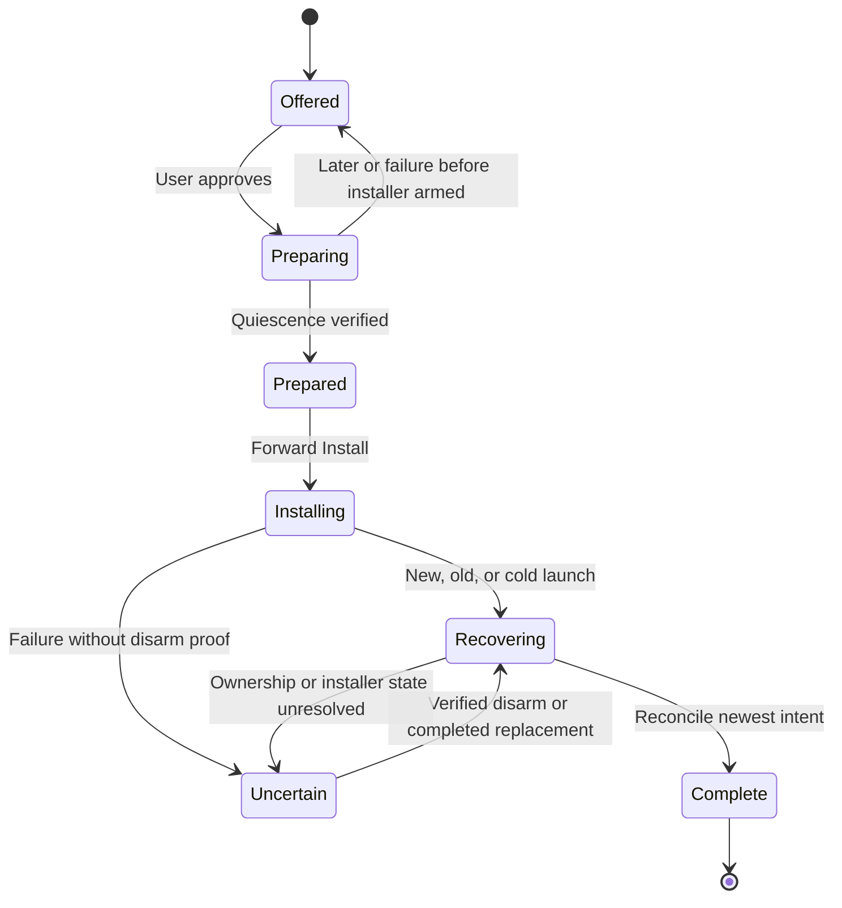

# Full macOS in-app updates

## Goal Capsule

Let a CodexCommander user discover a stable release, approve installation, and return to a working updated app without manually replacing its bundle. Preserve the user's previous proxy, routing, supervision, and login preferences across successful updates and recover safely from interruption.

The user has selected pause → download → install → resume and deferred Apple signing/notarization. This contract is ready for implementation, beginning with the bounded installer proof in U1. That proof is an execution gate, not a claim that the integration has already been tested. No updater code, builds, or tests were run during planning.

## Product Contract

### Summary and problem frame

The proxy ships inside the macOS app, but runs as a separate process. Replacing the bundle while that process or its supervisor still uses its contents is unsafe. A full updater must coordinate both lifetimes and distinguish update relaunch from normal app startup.

The v0.1.6 removal of Quit Menu Bar simplifies normal quitting; it does not supply an update transaction. The earlier shutdown incident reached the lifecycle helper timeout, but its initiating cause was not reproduced. Four isolated stop cycles subsequently completed in under a second; that does not establish that the original defect is eliminated.

### Key decisions and assumptions

- D1: Full download, install, and relaunch is required. `session-settled: user-directed`. A notification linking to a download page does not meet the request. Governs: R1, R2, R3, R4.
- D2: Keep Stop CodexCommander and Quit as the sole normal quit action, including Cmd+Q. `session-settled: user-approved`. Do not restore UI-only quit to support updates. Governs: R2.
- A1: Start with stable releases, automatic checks subject to the user's update preference, and a manual Check for Updates action. Installation requires explicit user consent; no unattended replacement.
- D3: When active requests exist at the install attempt, immediately show Update Anyway or Later. Update Anyway authorizes interrupting requests; Later leaves them running. There is no countdown or drain wait. `session-settled: user-approved — chosen over waiting for active requests: the user explicitly selected Update Anyway or Later`. Governs R2, R3, R8. A quiet proxy proceeds through normal install consent; interrupted work is never automatically replayed.
- A3: Existing v0.1.6 users need one manual installation of the first updater-enabled release. Do not assign the release number in this plan.

### Requirements

- R1 — Discovery: show available compatible stable updates, version and release notes; support manual checks, no-update, offline, and failed-check states without stopping the proxy.
- R2 — Consent: user-approved installation must visibly describe when service will pause. Download/install progress, cancellation where safe, and retry/recovery instructions must be accessible from the menu app. Preserve Stop CodexCommander and Quit, including Cmd+Q, as the sole normal quit action.
- R3 — Quiescence: before a bundle can be replaced, reject new admissions, obtain explicit Update Anyway confirmation when active work exists, use bounded process shutdown and verify exit, restore safe native routing where owned, stop every verified bundle-dependent proxy and supervisor, and verify no respawn. Failure blocks installation.
- R4 — Recovery: successful update restores the prior semantic state: running/proxied, running/native, or stopped. Preserve independently selected external routing. A newer explicit Stop and Quit or routing/service choice overrides the earlier snapshot. Cold launches and crashes must recover before ordinary startup policy runs.
- R5 — Ownership: independently installed CLI runtimes and services must not be stopped or migrated merely because they share configuration. Verify executable and supervisor provenance. Permit app-only replacement only when no bundle-dependent process remains; otherwise block with an actionable explanation.
- R6 — Exclusive transaction: CLI starts, services, routing mutations, duplicate menu app launches, and login launches cannot invalidate the replacement interval. Record newer semantic OFF or routing intent durably while excluding physical changes that would race replacement. Recovery must be idempotent, survive both processes exiting, and never replay a stale full configuration snapshot or persist secrets.
- R7 — Distribution trust: authenticate release metadata and the final archive, require compatible architecture/OS and increasing build identifiers, preserve nested framework layout and executable permissions, and reject invalid/tampered updates before installation. Preserve disabled login preferences and respect OS permission state; surface any required OS reapproval rather than claiming to bypass it.
- R8 — Failure experience: cancellation or an old-version relaunch cannot be reported as successful installation. Restore the captured semantic state, including leaving a previously stopped proxy stopped, only after proving replacement is no longer armed and reconciling newer user intent. An uncertain installer state stays stopped with safe routing and a visible recovery path; never silently leave requests pointed at a stopped owned proxy.

### Acceptance examples

| Starting state / event | Required outcome |
| --- | --- |
| Proxy running, Codex proxied, update succeeds | New app, proxy running, owned route restored |
| Proxy running, Codex native | New app, proxy running, Codex remains native |
| Proxy stopped | New app, proxy remains stopped |
| No update, offline or failed check | Proxy and routing remain unchanged |
| External provider or independent CLI service | Ownership respected; no implicit takeover |
| Active request during preparation | Immediately offer Update Anyway or Later; Later preserves work and explicit Update Anyway permits interruption |
| Stop and Quit after update intent captured | Newer OFF intent wins across installation and next launch |
| Helper timeout or supervisor respawn | Installation blocked; actionable recovery state |
| Cancel before any side effects | Original state unchanged |
| Crash after preparation or during install | Durable intent recovered before normal startup |
| Network or signature failure | No unverified install; resume only when installer is proven disarmed |

### Settled distribution and interruption choices

Apple signing/notarization is deferred, and the first implementation pauses service during download and installation. Their technical consequences are owned by KTD1 and KTD2 below; neither remains an unanswered product question.

### Scope boundary

First release covers this macOS bundle and its owned runtime. Cross-platform installers, background unattended installation, downgrade UI, beta channels, and migration of unrelated CLI installations are outside this request. There is no new UI-only quit action.

---

## Planning Contract

### Key Technical Decisions

- **KTD1 — Gate before Sparkle starts downloading.** Wrap Sparkle's standard user driver, retain the initial Install reply, prepare and verify shutdown, then forward Install. Downtime includes downloading. `(session-settled: user-approved — chosen over download-first runtime restructuring: the user accepts interruption and wants the simpler first version)`. Covers R2, R3, R8. Pin stable Sparkle 2.9.6 and disable automatic downloads/installations with `SUAllowsAutomaticUpdates=NO`; checking remains independent. Do not use the late relaunch callback as a veto.
- **KTD2 — Authenticate preview updates now; Apple signing later.** Keep the current ad-hoc, unnotarized preview distribution, but require Sparkle EdDSA archive and feed authentication. `(session-settled: user-directed — chosen over immediate Developer ID/notarization: Apple membership and signing will be arranged later)`. Covers R7. Preserve app identity and Sparkle signing-key continuity for that later transition; actual two-version preview qualification remains mandatory.
- **KTD3 — Durable update exclusion.** Add a versioned transaction record under the existing per-user state location, separate from the Codex recovery journal. Serialize reads/writes under existing Ensure-before-Start authority. It records target/source identity, phase, original semantic intent, provenance, and relevant generation/fingerprints, never secrets or full settings. The record lives outside the app bundle so replacement cannot delete it. Every bundle-dependent start/supervisor/routing path checks it. Helper exit, age, or a missing process alone cannot clear replacement exclusion. Covers R3–R6, R8.
- **KTD4 — Reconcile before ordinary startup.** Dispatch update recovery before normal launch policy, including cold launch and login launch. Restore semantic intent only if it has not been superseded. Preserve supervisor ownership rather than replacing a supervised proxy with an unsupervised process. Explicit Stop and Quit records newer OFF intent before termination, including while an update is pending. Newer semantic intent changes the recovery outcome but never clears physical replacement exclusion while an installer may still run. Covers R2, R4–R6.
- **KTD5 — Stable feed on GitHub release assets.** Use `https://github.com/pavelhov/CodexCommander/releases/latest/download/appcast.xml` as the fixed stable feed. Every release made latest must contain the complete signed feed and referenced immutable archives. Assemble assets in a draft release, verify them, then publish and set latest. Keep previous compatible items in the feed. Never rely on a docs-site deployment or edit an archive after signing. Covers R1, R7.
- **KTD6 — Strict distribution checks.** Embed the Sparkle public key, require signed feed and archive verification before extraction, and configure no expiration-based unsigned-feed fallback using the pinned framework's supported setting. Require an explicit monotonically increasing positive-integer `MACOS_BUILD_NUMBER` for updater release packaging, independent of the display version. Allocate it above all supported published build identifiers, verify ordering with the pinned updater comparator, and reject a missing, reused or non-increasing value; never silently fall back to the display version. Pin the dependency revision/checksum and preserve complete framework structure with narrowly scoped staging. Covers R7.
- **KTD7 — Explicit failure ownership.** When this transaction has not forwarded Install and startup reconciliation has established that no prior installer is armed, cancellation reverses completed preparation changes and restores admission and prior semantic state unless newer user intent supersedes it. A preexisting pending installer instead enters the guarded recovery path; absence of a current Install reply is not evidence of disarm. After forwarding, restore the old runtime only when installer disarm is proven. Unknown state stays safely stopped with a recovery action; a timeout or nil Sparkle error is not success. If U1 cannot establish definitive disarm or an actionable safe recovery with pinned public behavior, stop dependent integration and revise this contract; do not ship a guessed callback sequence. Covers R8.

### High-Level Technical Design

```mermaid
sequenceDiagram
    participant User
    participant Menu as Menu app / user-driver wrapper
    participant Helper as Lifecycle helper
    participant State as Durable transaction and authority
    participant Proxy as Bundled proxy / supervisor
    participant Sparkle as Sparkle installer
    User->>Menu: Approve update
    Menu->>Helper: Prepare identified target
    Helper->>State: Persist intent and close new admissions
    Helper->>Proxy: Check active work under admission exclusion
    alt Active work exists
        Helper-->>Menu: Confirmation needed
        Menu-->>User: Active requests may fail; Update Anyway or Later
        User->>Menu: Explicit choice
        Menu->>Helper: Cancel preparation or confirm cancellation
    end
    Helper->>Proxy: Restore owned routing, stop, verify no respawn
    Helper->>State: Persist prepared exclusion
    Helper-->>Menu: Verified prepared
    Menu->>Sparkle: Forward retained Install reply
    Sparkle->>Sparkle: Download, verify, replace, relaunch
    Menu->>State: Reconcile source/target and newer intent before startup
    Menu->>Helper: Restore authorized prior semantic state
```

The Later branch ends preparation and does not reach shutdown or Install. Update Anyway permits local request interruption; remote provider work might continue and cannot be promised to roll back. A request that arrives after admission closes receives a bounded unavailable response; it is never silently replayed. Admission exclusion and interruption are scoped to owned bundle-dependent processes.



The acceptance matrix in the Product Contract governs running/native/stopped combinations. There is one update transaction at a time. The native app owns presentation and Sparkle; the allowlisted helper owns lifecycle changes; the existing cross-process authority and durable record exclude unsafe starts. AppKit deferred termination may provide defense in depth, but cannot replace the early gate or durable record.

### Evidence and constraints

Ordinary launch through `app/Sources/MenuBarCore/ActionCoordinator.swift` can enable managed routing. `src/cli/proxy-lifecycle.ts` already restores routes, stops supervisors and verifies inactivity. `src/server/proxy-lifecycle-authority.ts` supplies ordered authority, but its process locks cannot protect an interval after the helper exits. `src/cli/service-command.ts`, `src/service.ts`, and `src/codex/routing-transition.ts` therefore participate in update exclusion and recovery.

Pinned Sparkle's asynchronous initial Install reply is a usable early gate. Its later ready-to-relaunch callback may not occur before installation on termination, and dismissal can leave installation armed. The public contracts and implementation examined are the [user driver](https://github.com/sparkle-project/Sparkle/blob/2.9.6/Sparkle/SPUUserDriver.h), [UI driver](https://github.com/sparkle-project/Sparkle/blob/2.9.6/Sparkle/SPUUIBasedUpdateDriver.m), [core driver](https://github.com/sparkle-project/Sparkle/blob/2.9.6/Sparkle/SPUCoreBasedUpdateDriver.m), and [installer driver](https://github.com/sparkle-project/Sparkle/blob/2.9.6/Sparkle/SPUInstallerDriver.m). U1 must establish pending-install and disarm behavior in real bundles; source inspection is not a substitute.

`app/Package.swift` currently has no dependencies, and `scripts/build-macos-app.sh` assembles bundles manually. Add the complete framework, runtime search path, and inside-out nested signing without weakening existing source-tree symlink rejection. Keep MenuBarCore independent of Sparkle. See [Sparkle publishing](https://sparkle-project.org/documentation/publishing/), [customization](https://sparkle-project.org/documentation/customization/), and the pinned [package](https://github.com/sparkle-project/Sparkle/blob/2.9.6/Package.swift).

### Deferred work and implementation unknowns

Apple Developer ID signing/notarization, download-first runtime restructuring, beta channels, unattended updates, and cross-platform installers are separate follow-ups. The initial release must remain labeled an unnotarized preview. Later signing follows Apple's [notarization workflow](https://developer.apple.com/documentation/security/customizing-the-notarization-workflow).

U1 resolves concrete pending-installer inspection and disarm evidence. Exact helper method names, admission integration seam, and durable-record schema are implementation choices constrained by KTD3–KTD7. No product choice remains blocking. The first implementation unit deliberately blocks downstream integration if the pinned framework cannot satisfy the contract; it must not silently expand into a Sparkle fork or a runtime migration.

---

## Implementation Units

### U1. Prove the pinned installer gate and recovery boundary

**Goal:** Establish the real framework behavior before coupling it to the live lifecycle.

**Requirements:** R2, R3, R8; KTD1, KTD2, KTD7.

**Dependencies:** None.

**Files:** `app/Package.swift`; new `app/Sources/MenuBarUI/UpdateController.swift`; new `app/Sources/MenuBarCore/UpdateCoordinator.swift`; new `app/Sources/MenuBarCoreTests/UpdateSuite.swift`; `app/Sources/MenuBarCoreTests/main.swift`. Keep temporary two-version proof bundles and evidence under `.tmp/`.

**Approach:** Build a minimal wrapper around the standard driver in an isolated fixture, with injected preparation and installer-state boundaries. Retain the early reply exactly once and model prepared, armed, cancelled and uncertain outcomes separately. Establish how a preexisting pending installer is detected before any startup; prove the exact supported disarm/recovery path. Production menu wiring waits for this proof.

**Execution note:** Begin with two packaged fixture versions outside the checkout and isolated preferences/config. Limit the proof to install gating, termination, cancellation and restart; if no supported proof exists, report the failing invariant and halt U2–U6 integration for plan revision.

**Test scenarios:**

- Hold Install while preparation is pending: no download/extraction/installer starts.
- Fail preparation or choose Later: no installer is armed.
- Crash before forwarding, during download, and after staging: the next launch identifies a pending installer before starting a proxy.
- Cancel at each framework boundary: confirm either acknowledged disarm or visible stopped recovery; never infer success from a nil error.
- Complete a real old-to-new preview update: target build identity is observable and callback ordering recorded without private APIs.

**Verification:** Source-supported early gating, real preview replacement, and deterministic pending/disarm outcomes are demonstrated. Unsupported behavior blocks dependent work.

### U2. Add durable preparation and start exclusion

**Goal:** Establish an install interval that survives every participating process exiting.

**Requirements:** R3, R5, R6, R8; KTD3, KTD7.

**Dependencies:** U1.

**Files:** New `src/server/macos-update-transaction.ts`; `src/server/proxy-lifecycle-authority.ts`; `src/cli/proxy-lifecycle.ts`; `src/cli/foreground-proxy.ts`; `src/cli/service-command.ts`; `src/service.ts`; `src/server/index.ts` and existing request-admission seam selected during implementation; new `tests/macos-update-transaction.test.ts`; `tests/proxy-lifecycle-concurrency.test.ts`; `tests/service-stop-verification.test.ts`.

**Approach:** Persist minimal intent under lifecycle authority before side effects. Add bundle provenance checks, active-work detection under admission exclusion and explicit-confirmation interruption. Use the existing bounded process termination/escalation policy and verify exit; do not wait for full request completion. Make CLI starts, supervisor children and service changes honor active transactions; preserve an actionable recovery path rather than clearing records by age. Verify quiescence after supervisor shutdown.

**Test scenarios:**

- A quiet proxy stops through bounded lifecycle termination and verified exit.
- Active work exists: immediately report confirmation required; Later reopens admission and preserves work.
- Explicit Update Anyway cancels only owned remaining work, never replays it, and still verifies shutdown before preparation succeeds.
- Concurrent CLI start, supervisor respawn and duplicate prepare cannot invalidate prepared exclusion.
- An unrelated CLI runtime remains untouched; stale or uncertain ownership blocks bundle-dependent replacement.
- Helper timeout or crash leaves recoverable durable state and never reports prepared without verification.

**Verification:** The replacement interval excludes all identified bundle-dependent entrants and has tested recovery after helper exit.

### U3. Implement semantic resume and conflict handling

**Goal:** Restore the newest user intent rather than ordinary startup defaults.

**Requirements:** R2, R4–R6, R8; KTD3, KTD4, KTD7.

**Dependencies:** U2.

**Files:** `src/cli/macos-lifecycle.ts`; `src/cli/proxy-lifecycle.ts`; `src/codex/routing-transition.ts`; `src/cli/service-command.ts`; `src/service.ts`; `app/Sources/MenuBarCore/LifecycleHelper.swift`; `app/Sources/MenuBarCore/ActionCoordinator.swift`; `app/Sources/MenuBarCore/LaunchAtLogin.swift`; `tests/macos-lifecycle.test.ts`; `tests/codex-native-routing-escape.test.ts`; `tests/macos-update-transaction.test.ts`; `app/Sources/MenuBarCoreTests/LifecycleHelperSuite.swift`; `app/Sources/MenuBarCoreTests/LaunchAtLoginSuite.swift`.

**Approach:** Expose allowlisted prepare, cancel and reconcile operations with validated transaction/target identity. Compare generation and ownership before restoring routes/services. Distinguish expected target, old bundle after failure, and unrelated manual replacement. Reconcile login registration with existing preference and OS permission semantics.

**Test scenarios:**

- Running/proxied, running/native and stopped states restore exactly after successful replacement.
- Supervised service resumes using verified updated bundle paths; an unsupervised proxy stays unsupervised.
- Newer Stop and Quit or route selection wins over captured intent on immediate and cold launch.
- Unknown installer state remains stopped with safe owned routing; repeated recovery is idempotent.
- External routing, disabled login launch and denied login permission remain unchanged.

**Verification:** State-matrix tests establish recovery without copying whole configuration or accidentally enabling routing.

### U4. Wire the menu update experience

**Goal:** Offer updates and make preparation, interruption and recovery understandable.

**Requirements:** R1, R2, R4, R8; KTD1, KTD4, KTD7.

**Dependencies:** U1, U3.

**Files:** `app/Sources/MenuBarUI/UpdateController.swift`; `app/Sources/MenuBarCore/UpdateCoordinator.swift`; `app/Sources/MenuBarUI/AppDelegate.swift`; `app/Sources/MenuBarUI/Views.swift`; `app/Sources/MenuBarUI/OperationStatusView.swift`; `app/Sources/MenuBarUI/PopoverViewController.swift`; `app/Sources/MenuBarApp/main.swift`; `app/Sources/MenuBarCoreTests/UpdateSuite.swift`; `app/Sources/MenuBarCoreTests/ActionSuite.swift`; `app/Sources/MenuBarUITests/main.swift`.

**Approach:** Initialize recovery before ordinary startup and only then enable checks. Add Check for Updates, opt-in automatic checks and dockless update reminders. Present pause duration honestly, immediate active-request warning with Update Anyway/Later, download/install state and actionable recovery. Keep one normal Stop and Quit path; updater-authorized termination avoids a redundant normal-quit prompt only after preparation succeeds.

**Test scenarios:**

- Offline/no-update/check failure leaves a running proxy untouched.
- User-approved update reaches the helper before forwarding Install; duplicate clicks cannot forward twice.
- Active requests immediately present Update Anyway/Later without a countdown; Later preserves them and never forwards Install.
- Cmd+Q while preparing or staged records newer OFF intent; no UI-only quit reappears.
- Login/cold launch with a transaction reconciles before ordinary Start policy.
- Dockless reminders, keyboard access, progress and recovery action remain reachable.

**Verification:** UI and policy coverage reflect the real U1 driver behavior and preserve normal quit semantics.

### U5. Package authenticated preview updates and publish the feed

**Goal:** Produce complete, verifiable universal bundles and a consistent stable feed.

**Requirements:** R1, R7; KTD2, KTD5, KTD6.

**Dependencies:** U1; final qualification additionally depends on U4.

**Files:** `scripts/build-macos-app.sh`; `scripts/package-macos-release.sh`; new `scripts/generate-macos-appcast.sh`; `app/Package.swift` and its resolved dependency file; `tests/macos-build-script.test.ts`; `tests/package-tree-safety.test.ts`; new `tests/macos-appcast.test.ts`; `structure/06_docs-and-release.md`.

**Approach:** Stage the pinned framework and helper tree with correct permissions/search paths and narrowly bounded symlinks, then sign nested components and outer preview bundle. Require and validate the release build number, preserving the separate display version, and reject non-increasing builds. Generate signed metadata only from final archives. Store private update-signing material in maintainer secret storage, never the repository/logs; embed only the public key. Draft-release publication must reject missing feed/archive/signature assets and avoid making an incomplete release latest.

**Test scenarios:**

- Both architecture slices, framework helpers, expected symlinks and loader paths survive packaging.
- Malformed framework links fail without weakening source-tree safety checks.
- Existing installed identifiers and successive integer release builds compare monotonically; missing, reused or decreasing build numbers fail packaging.
- Tampered archive, unsigned/invalid feed, expired feed under strict policy and incompatible OS/build cannot install.
- GitHub latest redirects resolve to the complete signed feed; draft or partial assets never become the advertised release.
- Preview source-to-target update succeeds under the actual current signing mode; inability blocks release rather than claiming notarized readiness.

**Verification:** Real packaged updates authenticate correctly and publication ordering is documented and validated. `MAINTAINERS.md` requires explicit security review, including written considerations in the PR description for a single-maintainer change.

### U6. Qualify recovery and document rollout

**Goal:** Validate the complete installed experience and explain bootstrap/recovery.

**Requirements:** R1–R8; KTD1–KTD7.

**Dependencies:** U2–U5.

**Files:** New `tests/e2e-style/macos-update.test.ts` or a macOS-only installed-bundle harness kept alongside existing app tests; `docs-site/src/content/docs/guides/macos-menu-bar.md`; `docs-site/src/content/docs/getting-started/installation.md`; corresponding translated pages; `structure/06_docs-and-release.md`.

**Approach:** Exercise the full acceptance matrix using isolated installed old/new app bundles and configuration, including crashes and CLI/service races. Document one manual bootstrap from v0.1.6, expected download downtime, explicit interrupted-request behavior, unnotarized preview limitations, signing-key custody and operational recovery. Keep the developer's live proxy untouched.

**Test scenarios:**

- Real successful update preserves every semantic state in the Product Contract matrix.
- Slow/failed download and each cancellation/crash boundary either safely resume or present usable recovery.
- An already staged installer, helper timeout and respawning supervisor cannot bypass exclusion.
- Old-version or unrelated-version relaunch is not reported as target installation success.
- English and translated instructions match the shipped UI and one-time bootstrap requirement.

**Verification:** Installed-bundle evidence and repository checks support release readiness; no mock-only installation claim.

---

## Verification Contract

Run `bun run typecheck`, `bun run test:parallel`, `bun run test:macos`, and `bun run privacy:scan`, plus `bun run prepush` and affected docs/build/package checks. Follow AGENTS.md's failed-file-only rerun policy. Unit-local scenarios above define coverage; do not run the developer's live shutdown path for verification.

Qualification must include an actual installed source-to-target update on both supported CPU architectures, complete nested bundle integrity checks, network/signature failure, pending installer detection, cancellation/disarm, crash recovery, CLI/service contention, and semantic intent preservation. A U1 failure stops dependent work for a technical plan revision; it is not waived by green mock tests. These are future checks, not planning results.

## Definition of Done

- R1–R8 and U1–U6 verification outcomes are met; no unresolved installation/disarm ambiguity remains in supported flows.
- Automatic checks never interrupt work. User-approved installation follows the selected early-pause flow, with immediate Update Anyway/Later confirmation when active requests exist.
- Successful, failed and interrupted updates preserve or safely reconcile newest routing/running/supervision/login intent.
- Signed feed and archive, complete universal preview bundle, monotonic versioning and draft-first publication are qualified with two real installed versions.
- Required repository checks, English/translation updates and explicit release/dependency security review are complete. No unrelated live runtime is modified during qualification.
- The release remains honestly labeled unnotarized; no Apple membership prerequisite is imposed on this initial implementation. Apple signing and download-first optimization remain follow-ups.

## Planning Confidence

Product choices are settled and were rechecked during the LFG planning resume. The confidence audit found no new planning-owned blocker or contradiction in the settled choices, dependency ordering, or requirement-to-verification coverage. Lifecycle grounding and early-gate source evidence are strong; U1 deliberately owns execution-only proof of pending installer and definitive disarm. This is implementation-ready because the initial work and its stop condition are explicit, not because installation has already been validated. The mandatory final document review is completed by the coordinating planning run before handoff.
