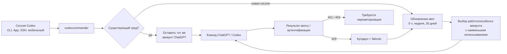

<h3 align="center">make codex open!</h3>
<p align="center"><b>Универсальный прокси провайдеров для OpenAI Codex &amp; Claude Code</b><br>
Две команды — и Codex, и Claude Code работают на любой LLM, которую вы укажете.</p>

```bash
bun install
bun run build:gui
bun run src/cli/index.ts init
bun run src/cli/index.ts start
```

<p align="center">
  
</p>

<p align="center">
  <a href="../README.md">English</a> · <a href="README.ko.md">한국어</a> · <a href="README.zh-CN.md">简体中文</a> · <b>Русский</b> · <a href="README.ja.md">日本語</a> · 📖 <a href="../docs-site/src/content/docs/ru/getting-started/installation.md"><b>Полная документация →</b></a>
</p>

Используйте Claude, Gemini, Grok, GLM, DeepSeek, Kimi, Qwen, Ollama или любую другую LLM с Codex — и с **Claude Code** — не дожидаясь, пока кто-нибудь добавит поддержку.

CodexCommander — это лёгкий локальный прокси, который транслирует Responses API Codex в протокол, понятный вашему провайдеру. Потоковая передача, вызовы инструментов, токены рассуждений, изображения — всё работает в обе стороны.

Кроме того, codexcommander умеет управлять **пулом аккаунтов ChatGPT** для аутентификации Codex. Добавьте
несколько аккаунтов ChatGPT / Codex, обновляйте их квоты (5 ч / неделя / 30 дней) в панели управления —
и новые сессии будут автоматически направляться на работоспособный аккаунт с наименьшим использованием.
Существующие треды Codex остаются закреплёнными за аккаунтом, с которого они начались, поэтому
длительные сессии по SSH, в tmux или с мобильного устройства не переключаются между аккаунтами
посреди разговора.

```
Codex CLI / App / SDK ──/v1/responses──▶ codexcommander ──▶ Any provider
                                              │
              Anthropic · Google · xAI · Kimi · Ollama Cloud · Groq
              OpenRouter · Azure · DeepSeek · GLM · …and OpenAI itself
```



## Поддерживаемые платформы

| ОС | Статус | Менеджер служб |
|---|---|---|
| macOS (arm64 / x64) | Полная поддержка | launchd |
| Linux (x64 / arm64) | Полная поддержка | systemd (пользовательский unit) |
| Windows (x64) | Полная поддержка | Task Scheduler (скрыто) / опциональная нативная служба (`--native`, WinSW) |

Требуется исходный checkout и установленный [Bun](https://bun.sh). Все три платформы работают нативно (WSL на Windows не требуется). npm-пакет сейчас не опубликован.

## Быстрый старт

### Для людей

```bash
bun install
bun run build:gui
bun run src/cli/index.ts init
bun run src/cli/index.ts start   # для фонового режима используйте service вместо start
```

Откройте **http://localhost:10100** и настройте всё в веб-дашборде: добавьте провайдеров
(40+ встроенных, либо любой OpenAI-совместимый endpoint), выберите модели, управляйте
аккаунтами. `ccx gui` в любой момент снова откроет дашборд.

### Для агентов

```bash
bun run src/cli/index.ts init
bun run src/cli/index.ts start
```

В этом checkout любую приведённую ниже команду `ccx <args>` можно выполнить как `bun run src/cli/index.ts <args>`.

`ccx init` никогда не запускает прокси, поэтому сначала выполните инициализацию, а затем запускайте
обычный CLI или service. Запуск без созданной конфигурации завершается отказом. Headless-команды
вроде `ccx provider add` и `ccx combo set` обращаются к **живому** прокси и завершаются с ненулевым
кодом, если он недоступен. Состояние запущенного прокси показывают `ccx status`, `ccx doctor` и `ccx health`.

## Добавление провайдера

Быстрее всего добавить провайдера через веб-панель управления:

```bash
ccx gui
```

Команда откроет панель управления по адресу `http://localhost:10100`. Далее:

1. Нажмите **«Add Provider»**
2. Выберите одного из **более чем 40 встроенных провайдеров** — или укажите собственный OpenAI-совместимый эндпоинт
3. Вставьте свой API-ключ (или войдите через OAuth для Anthropic, xAI и Kimi)
4. Модели **обнаруживаются автоматически** через эндпоинт провайдера `/v1/models`

Новый провайдер готов к работе сразу же. Перезапуск не требуется.

Провайдеров также можно добавлять через `ccx init` (интерактивный CLI) или напрямую редактируя `~/.codexcommander/config.json`.

## Маршрутизация моделей

Обращайтесь к любому настроенному провайдеру и модели с помощью синтаксиса `provider/model`:

Провайдеры, у которых собственные id моделей содержат `/` (zenmux, openrouter, nvidia, …),
отображаются в Codex с внутренними слэшами, заменёнными на `-` (например,
`zenmux/moonshotai-kimi-k3-free`); прокси прозрачно преобразует такие id обратно в нативные,
а исходная форма со всеми слэшами тоже продолжает работать.

```bash
# Claude Opus через Anthropic
codex -m "anthropic/claude-opus-5" "Explain this stack trace"

# Gemini через Google
codex -m "google/gemini-3-pro" "Write unit tests for auth.ts"

# GLM через Ollama Cloud
codex -m "ollama-cloud/glm-5.2" "Write a SQL migration"

# Локальная модель через Ollama
codex -m "ollama/llama3" "Refactor this function"
```

Если префикс `provider/` опущен, codexcommander направляет запрос провайдеру по умолчанию — либо автоматически подбирает провайдера по шаблону имени модели (например, `claude-*` уходит в Anthropic, `gpt-*` — в OpenAI).

Маршрутизируемые модели также появляются в селекторе моделей **Codex App** с настройками уровня рассуждений для каждой модели:

Актуальные сборки Codex могут показывать уровни рассуждений `low`, `medium`, `high`, `xhigh`,
`max` и `ultra`, если модель их объявляет. codexcommander сохраняет `xhigh` и `max` как разные уровни,
пока конфигурация провайдера явно не сопоставит один другому. `ultra` повторяет семантику
оригинального Codex: этот уровень включает максимальные рассуждения и проактивное мультиагентное
делегирование на стороне клиента, а перед отправкой запроса провайдеру преобразуется в `max`.
Маршрутизируемые модели объявляют его только тогда, когда конфигурация провайдера включает его
через `reasoningEfforts`.

GPT-5.6 Sol/Terra/Luna добавлены как готовые к развёртыванию записи каталога для пресетов
OpenAI API-ключа и OpenRouter (`gpt-5.6-sol`, `gpt-5.6-terra`, `gpt-5.6-luna`; OpenRouter
использует `openai/...`). Их доступность по-прежнему ограничена превью-доступом на вышестоящей
стороне; codexcommander лишь подготавливает маршрутизацию и метаданные каталога для аккаунтов и
провайдеров, которые могут их обслуживать.

<p align="center">
  
</p>

## Режимы аккаунтов провайдера OpenAI

| ID провайдера | Маршрут | Учётные данные | Поведение |
|---|---|---|---|
| `openai` | Вход Codex | Основной + добавленные аккаунты Codex | По умолчанию Pool; опциональный режим Direct |
| `openai-apikey` | OpenAI API | API-ключ / пул ключей | Без маршрутизации аккаунтов Codex |

- Режим Pool охватывает основной вход Codex и добавленные аккаунты, поддерживая привязку (affinity), квоты, кулдаун и отказоустойчивое переключение (failover).
- Режим Direct обходит состояние пула и использует только bearer-токен текущего вызывающего или основного входа.
- Для новых установок и конфигураций без сохранённого режима по умолчанию действует Pool. Режим
  меняется на странице **Providers** панели управления; id моделей в обоих режимах остаются без префикса.
- Уровень API включает виртуальные Pro-модели (`gpt-5.6-sol-pro`, `gpt-5.6-terra-pro`,
  `gpt-5.6-luna-pro`). На уровне протокола каждая из них переписывается в свою базовую модель с
  `reasoning.mode: "pro"`.
- Его каталог зафиксирован на восьми id: `gpt-5.5`, `gpt-5.6`, Sol/Terra/Luna и три
  соответствующих виртуальных Pro-id. Обобщённого алиаса `gpt-5.6-pro` не существует.
- Compact-запросы сохраняют выбранный уровень, но отправляют базовую модель без объекта reasoning.
- Официальные метаданные API: контекст 1 050 000 токенов и максимум 922 000 входных токенов.

Используйте `gpt-5.6-sol` для настроенного режима аккаунтов `openai` и
`openai-apikey/gpt-5.6-sol` для API-ключа. Учётные данные входа Codex и API никогда не подменяют
друг друга.

### Поведение пула аккаунтов

Откройте раздел **Codex Auth** в панели управления, чтобы добавить аккаунты и выбрать, какой из них
обслужит следующую сессию Codex. codexcommander гарантирует следующее поведение:

- **Существующие сессии сохраняют привязку.** Идентификатор треда привязывается к выбранному аккаунту и
  переиспользуется на последующих ходах, поэтому длинный запрос или сессия с мобильного устройства
  либо по SSH продолжает работать с тем же аккаунтом.
- **Новые сессии могут маршрутизироваться автоматически.** При включённом автопереключении codexcommander
  сравнивает самое «горячее» из известных окон квоты по использованию за 5 ч, неделю и 30 дней и,
  как только активный аккаунт пересекает порог, выбирает для новых сессий подходящий аккаунт
  с меньшим использованием.
- **Проверка квот встроена.** Панель управления обновляет квоты всех аккаунтов одним кликом,
  а журнал запросов помечает трафик пула порядковыми номерами аккаунтов без персональных данных.
- **Сбои обрабатываются безопасно (fail closed).** При сбое токена аккаунт помечается как требующий
  переавторизации вместо тихого перехода на другие учётные данные; ответы 429 о превышении квоты
  отправляют аккаунт в кулдаун, а последующая работа может быть переключена на другой подходящий
  аккаунт пула.

## Основные возможности

- **Любая LLM в Codex.** Пять протокольных адаптеров покрывают Anthropic Messages, Google Gemini, Azure, сквозной режим OpenAI Responses и любой OpenAI-совместимый эндпоинт Chat Completions — это более 40 провайдеров из коробки.
- **Любая LLM и в Claude Code.** Тот же демон обслуживает Anthropic Messages API (`/v1/messages` + `count_tokens`): `ccx claude` запускает Claude Code с готовой конфигурацией, а маршрутизируемые модели появляются в его селекторе `/model` под текущими каноническими алиасами. Сопоставления моделей настраиваются на странице Claude панели управления.
- **Безопасный пул аккаунтов ChatGPT.** Существующие треды Codex остаются на одном аккаунте,
  а новые сессии могут автоматически выбирать из пула аккаунт с меньшим использованием —
  с обновлением квот и метками запросов без персональных данных.
- **Один вход — и никаких API-ключей.** Поддержка OAuth для xAI, Anthropic и Kimi позволяет аутентифицироваться существующим аккаунтом; токены обновляются автоматически. Либо пробросьте свой `codex login`, вставьте API-ключ или используйте ссылки вида `${ENV_VAR}` — как вам удобнее.
- **Работает везде, где работает Codex.** Автоматически встраивается в Codex CLI, TUI, App и SDK. Маршрутизируемые модели отображаются в селекторе моделей Codex наравне с нативными.
- **Встраивание без риска для истории.** При локальной установке прокси перенаправляет встроенный провайдер Codex `openai` на себя одной строкой `openai_base_url` — новые треды сохраняют нативный тег провайдера, поэтому текущая история чатов никогда не перепривязывается, и даже некорректное завершение работы не может её скрыть. При удалённой/LAN-привязке используется отдельная запись провайдера, поскольку ей нужен заголовок с API-ключом.
- **Делегируйте задачи подходящей модели.** Через панель управления или конфигурацию можно вывести до пяти маршрутизируемых или нативных моделей как рекомендуемые варианты подагентов Codex (это не полный список разрешённых ID) — сложные задачи отправляйте модели с развитыми рассуждениями, быстрые — дешёвой. На мультиагентной поверхности v2 (GPT-5.6 Sol/Terra) прокси внедряет компактные указания по делегированию: предпочтительную модель и уровень рассуждений подагента (`injectionModel` / `injectionEffort`), список отобранных моделей со шкалой уровней, которую поддерживает каждая из них, и правила `fork_turns`, позволяющие кросс-модельным вызовам `spawn_agent` применять свои переопределения. Известное ограничение: когда нативный родитель порождает маршрутизируемого потомка, тело задачи в настоящий момент может прийти зашифрованным на бэкенде и потеряться ([#92](https://github.com/pavelhov/CodexCommander/issues/92)) — для надёжного делегирования между провайдерами используйте поверхность v1. Хотите свои формулировки? Задайте `injectionPrompt` с плейсхолдерами `{{model}}` / `{{effort}}` / `{{roster}}`.
- **Готовность к превью-релизам OpenAI.** Записи GPT-5.6 Sol/Terra/Luna сохраняют исходные шкалы уровней рассуждений. Direct/Multi используют контракт Codex на 372k токенов; OpenAI API и OpenRouter — метаданные на 1.05M, когда открыт вышестоящий доступ.
- **Суперспособности для любой модели.** Модели не от OpenAI получают настоящий веб-поиск и понимание изображений через сайдкар `gpt-5.4-mini`, работающий поверх вашего входа ChatGPT.
- **Нативная генерация изображений.** Автономный инструмент Codex `image_gen` использует `POST /v1/images/generations` для генерации и `POST /v1/images/edits` для правок; он не связан с размещённым инструментом Responses `image_generation`.
- **Видно, что происходит.** Веб-панель управления показывает провайдеров, статус OAuth, выбор моделей и живой журнал запросов, включая количество кэшированных и записанных в кэш токенов, когда вышестоящий провайдер их сообщает, — больше не нужно гадать, почему запрос не прошёл.
- **Работает в фоне.** Установите как системную службу (launchd / systemd / Task Scheduler) и забудьте о ней. На macOS/Linux прокси стартует при входе в систему; на Windows бэкенд Task Scheduler по умолчанию запускается при входе (без окон), либо используйте `ccx service install --native`, чтобы получить полноценную службу Windows, стартующую при загрузке.
- **Чистый выход без следов.** `ccx stop` (или кнопка Stop в панели управления) завершает работу прокси, останавливает фоновую службу, если она установлена, и возвращает Codex к исходной конфигурации. Обычный `codex` работает ровно так же, как раньше, — без остатков конфигурации и осиротевших процессов.

## Провайдеры и адаптеры

| Провайдер | Адаптер | Аутентификация |
|---|---|---|
| OpenAI (вход ChatGPT) | `openai-responses` | forward (ключ не нужен) |
| OpenAI (API-ключ) | `openai-responses` | key |
| Umans AI Coding Plan | `anthropic` | key |
| Anthropic Claude | `anthropic` | oauth / key |
| xAI Grok | `openai-chat` | oauth / key |
| Kimi (Moonshot) | `openai-chat` | oauth / key |
| Google Gemini | `google` | key |
| Azure OpenAI | `azure-openai` | key |
| Cursor (экспериментально) | `cursor` | панель управления/локальный конфиг; живой транспорт; небезопасное нативное локальное выполнение включается явно |
| Ollama Cloud + каталог из 17 провайдеров | `openai-chat` | key |
| Ollama / vLLM / LM Studio (локально) | `openai-chat` | key (обычно пустой) |
| Любой OpenAI-совместимый эндпоинт | `openai-chat` | key |

А также DeepSeek, Groq, OpenRouter, Together, Fireworks, Cerebras, Mistral, Hugging Face, NVIDIA NIM, MiniMax, Qwen Cloud, Tencent Cloud Coding Plan, SiliconFlow и другие. Полный список — в `ccx init` или в [документации по провайдерам](../docs-site/src/content/docs/ru/reference/configuration/providers.md).

## CLI

```bash
ccx init                       # интерактивная настройка
ccx start [--port 10100]       # запустить прокси; если порт занят, выбирается свободный
ccx stop                       # остановить + восстановить нативный Codex
ccx restore                    # восстановить без остановки (алиас: ccx eject)
ccx uninstall                  # удалить службу/shim/конфигурацию и восстановить нативный Codex
ccx ensure                     # запустить при необходимости + обновить конфигурацию/кэш Codex
ccx sync                       # обновить модели + заново встроиться в Codex
ccx codex-shim install         # выполнять `ccx ensure` при каждом запуске `codex`
ccx status                     # работает ли прокси?
ccx login <provider>          # вход через OAuth (xai, anthropic, kimi, cursor, ...)
ccx logout <provider>          # удалить сохранённый вход
ccx account <list|current|use> # просмотр/переключение аккаунтов и пулов API-ключей (маскировано; также refresh/auto-switch/remove/add-key)
ccx gui                        # открыть веб-панель управления
ccx claude [args...]           # запустить Claude Code, подключённый к прокси (обнаружение моделей включено)
ccx service [install|start|stop|status|uninstall]   # установить/обновить/запустить фоновую службу
```

### Автозапуск: служба или shim

У codexcommander есть два способа автоматически запускать прокси:

| | `ccx service` / `ccx service install` | `ccx codex-shim install` |
|---|---|---|
| **Как** | Менеджер служб ОС (launchd / systemd / schtasks) | Оборачивает скриптовые лончеры `codex`; настоящий `codex.exe` не затрагивается |
| **Когда** | Всегда работает после входа в систему | По требованию — выполняет `ccx ensure` при запуске `codex` |
| **Перезапуск** | Автоматический перезапуск при сбое | Запускается один раз на каждый вызов `codex` |
| **Обновления Codex** | Не влияют | Стабильно заменённый лончер восстанавливается следующей обычной командой `ccx` |
| **Удаление** | `ccx service uninstall` | `ccx codex-shim uninstall` |

Используйте **службу**, если прокси должен работать постоянно (рекомендуется для машин разработчиков).
Если внешнее обновление Codex перезапишет установленный shim, следующая обычная команда `ccx`
сохранит стабильный новый лончер в резервную копию и восстановит shim. Лончер, который ещё меняется,
остаётся нетронутым до следующей команды. Ошибка восстановления выдаёт предупреждение, но не приводит
к сбою запрошенной команды; ручной вариант — `ccx codex-shim install`. Для отключения установите
`codexShimAutoRestore` в `false` или задайте процессу
`CODEXCOMMANDER_CODEX_SHIM_AUTO_RESTORE=0`.
Используйте **shim** для лёгкого запуска прокси по требованию без фонового демона. Автозапуск через
shim включён по умолчанию и отключается в GUI-панели управления. Если настроенный порт прокси уже
занят, `ccx start` автоматически выберет другой свободный локальный порт и обновит настройки Codex.

### Удаление

Чтобы удалить локальное состояние, сначала выполните:

```bash
ccx uninstall
```

`ccx uninstall` останавливает прокси, удаляет установленную службу и shim для Codex,
восстанавливает нативные конфигурацию и каталог Codex и удаляет `~/.codexcommander`.

## Конфигурация

Конфигурация хранится в `~/.codexcommander/config.json`. Если файл не удаётся разобрать (например,
JSON обрезан или испорчен вручную), codexcommander сохраняет его резервную копию в
`config.json.invalid-<timestamp>`, выводит предупреждение и переходит на значения по умолчанию —
исходный файл никогда не теряется молча.

Типичная конфигурация с несколькими провайдерами:

```json
{
  "port": 10100,
  "defaultProvider": "anthropic",
  "providers": {
    "anthropic": {
      "adapter": "anthropic",
      "baseUrl": "https://api.anthropic.com",
      "authMode": "oauth",
      "defaultModel": "claude-sonnet-4-6"
    },
    "ollama-cloud": {
      "adapter": "openai-chat",
      "baseUrl": "https://ollama.com/v1",
      "apiKey": "${OLLAMA_API_KEY}",
      "defaultModel": "glm-5.2"
    }
  }
}
```

Записи провайдеров могут также задавать метаданные маршрутизируемого каталога. Используйте
`contextWindow` для видимого в Codex лимита контекста на весь провайдер, `modelContextWindows` —
для лимитов отдельных моделей, а `modelInputModalities` — для подсказок каталога
о входных модальностях конкретных моделей, например `["text"]` или `["text", "image"]`. Значения контекста лишь
ограничивают живые метаданные `/models` сверху; они никогда не увеличивают меньшее живое
контекстное окно. Встроенные резервные метаданные GPT-5.6 Sol/Terra/Luna используют контекстное
окно в 1 050 000 токенов для записей каталога OpenAI API-ключа и OpenRouter; вышестоящий
превью-доступ они не обходят. Полный список полей — в справочнике по конфигурации.

> **Контекст 1M у GLM-5.2 через Z.AI:** через адаптер `openai-chat` работают и `glm-5.2`,
> и `glm-5.2[1m]` — codexcommander отрезает завершающий суффикс `[1m]` перед отправкой
> запроса, поскольку OpenAI-совместимые эндпоинты отклоняют id со скобками
> (Z.AI 400, код 1211). Суффикс `[1m]` — это конвенция Claude Code / эндпоинтов Anthropic;
> чтобы использовать его нативно, направьте адаптер `anthropic` на кодинговую базу Z.AI
> (`https://api.z.ai/api/coding/paas/v4`). Контекстное окно 1M задавайте через каталог
> моделей (`modelContextWindows`), а не через имя модели.

Локальные модели тоже работают. Направьте codexcommander на любой OpenAI-совместимый сервер,
запущенный на вашей машине:

```json
{
  "port": 10100,
  "defaultProvider": "ollama",
  "providers": {
    "ollama": {
      "adapter": "openai-chat",
      "baseUrl": "http://localhost:11434/v1",
      "authMode": "key",
      "apiKey": "",
      "defaultModel": "llama3"
    },
    "vllm": {
      "adapter": "openai-chat",
      "baseUrl": "http://localhost:8000/v1",
      "authMode": "key",
      "apiKey": "",
      "defaultModel": "Qwen/Qwen3-32B"
    }
  }
}
```

Транспорт WebSocket по умолчанию выключен. Устанавливайте `"websockets": true`, только если хотите, чтобы Codex объявлял и использовал WebSocket-путь Responses вместо HTTP/SSE.

### Удалённый доступ

По умолчанию codexcommander привязывается к `127.0.0.1` (loopback) и не требует дополнительной аутентификации.
Если вы задаёте `"hostname": "0.0.0.0"`, открывая прокси в локальной сети, codexcommander требует bearer-токен
для защиты как управляющего API (`/api/*`), так и плоскости данных (`/v1/responses`,
`/v1/images/generations` и `/v1/images/edits`):

```bash
export CODEXCOMMANDER_API_AUTH_TOKEN="your-secret-token"
ccx start
```

Без этой переменной прокси откажется запускаться при привязке за пределами loopback. Если вы
устанавливаете фоновую службу для доступа из локальной сети, экспортируйте ту же переменную перед
`ccx service install`, чтобы менеджер служб её получил.
Клиенты (скрипты, удалённые машины) должны передавать токен в каждом запросе:

```
x-codexcommander-api-key: your-secret-token
```

Токен сравнивается за постоянное время для защиты от атак по времени.

Описание всех полей — в **[справочнике по конфигурации](../docs-site/src/content/docs/ru/reference/configuration/server.md)**.

## Документация

Документация по установке, провайдерам, маршрутизации, сайдкарам, интеграциям и CLI/конфигурации находится в [`docs-site/`](../docs-site). Она собирается локально; автоматизация публикации в репозитории отсутствует.

Инварианты для мейнтейнеров находятся в [`structure/`](../structure), а поддерживаемые технические заметки — в [`docs/`](../docs).
Инструкции для контрибьюторов — в [`CONTRIBUTING.md`](../CONTRIBUTING.md), а порядок сообщений
о проблемах безопасности — в [`SECURITY.md`](../SECURITY.md).

## Разработка

```bash
cd /path/to/CodexCommander
bun install
bun run dev:proxy    # запустить API прокси в dev-режиме
bun run dev:gui      # запустить dev-сервер панели управления в другом терминале
bun x tsc --noEmit   # проверка типов
```

`bun run dev` — алиас `bun run dev:proxy`. В чекауте исходников API прокси
предоставляет `/healthz`, `/v1/responses`, `POST /v1/images/generations`,
`POST /v1/images/edits` и `/api/*`; `GET /` отдаёт упакованную панель управления только после того, как
`bun run build:gui` создаст `gui/dist`. Пока вы работаете над панелью управления, запускайте фронтенд отдельно:

```bash
bun run dev:gui
```

См. **[руководство для контрибьюторов](../CONTRIBUTING.md)**.

## Отказ от ответственности

codexcommander — независимый проект, поддерживаемый сообществом; он **не аффилирован с OpenAI, Anthropic или каким-либо другим провайдером и не одобрен ими**.

Некоторые провайдеры — в частности Anthropic (Claude) — могут приостанавливать или ограничивать аккаунты, которые направляют API-трафик через сторонние прокси. **Используйте на свой страх и риск (UAYOR).** Прежде чем подключать провайдера, изучите его условия использования и убедитесь, что доступ через прокси разрешён. Мейнтейнеры codexcommander не несут ответственности за какие-либо действия вышестоящих провайдеров в отношении аккаунтов.

## Лицензия

MIT
